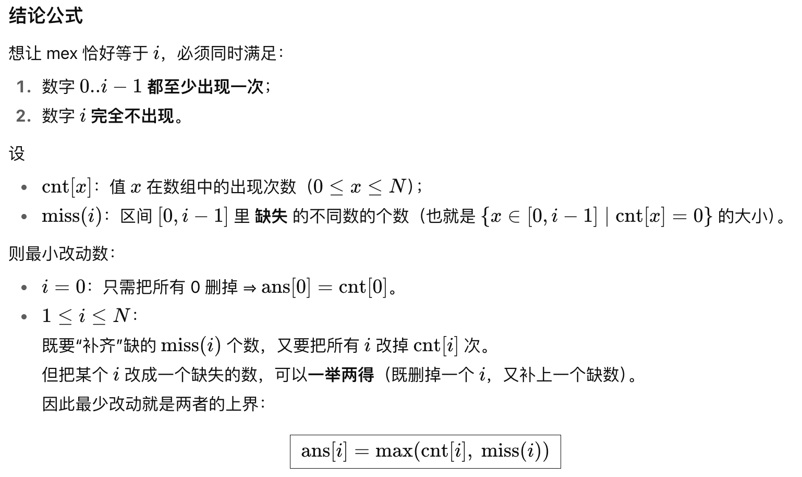
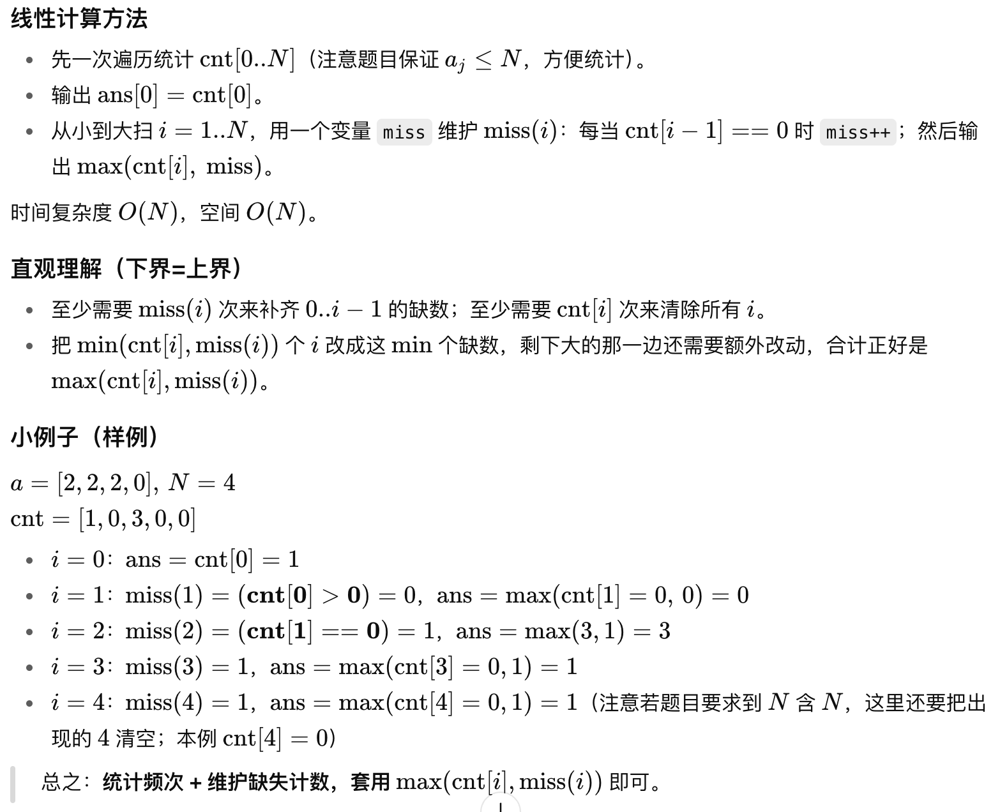

## USACO 2025 February Contest, Bronze

### Problem 1. Astral Superposition

题意：画布对称 + 动态单点翻转

思路：核心思路是把整张 `N×N`画布按水平/垂直中线的二重对称分成很多个4 元轨道（orbit）来独立处理。

### 📌 关键观察

- 以中线为界，任意一个格子 `(i,j)` ，及它关于两条中线反射得到的 3 个格子：
  $$
  (i,j),\ (i,\,N-1-j),\ (N-1-i,\,j),\ (N-1-i,\,N-1-j)
  $$
  这 4 个格子构成一个轨道。因为 `N` 是偶数，没有格子落在中线上，所以每个轨道恰有 4 个格子，不同轨道互不相交，覆盖全图。

- 题目要求的“从右上象限镜像到其它象限”本质上要求：每个轨道里的 4 个格子最终必须一致（要么全是‘#’，要么全是‘.’）。
   因为右上象限决定了轨道的最终取值，但对每个轨道我们都可以独立选择成‘#’或‘.’，互不影响。

### 📌 每个轨道的最小代价

- 设某个轨道里当前有 `k`个‘#’（其余 `4-k` 个是‘.’），把这个轨道“全变成同一个字符”的最少操作是：
  $$
  \min(k,\ 4-k)
  $$
  ——要么把这 `k` 个‘#’清掉（变‘.’），要么把那 `4-k` 个‘.’涂上（变‘#’），二者取较小。

### 📌 全局答案与更新

- 初始答案就是所有轨道代价的总和：
   $$
   \sum \min(k_{\text{orbit}}, 4-k_{\text{orbit}})
   $$
   
- 单点翻转更新（把某个 `(r,c)` 的格子‘#’↔‘.’）只会影响它所属的那一个轨道的计数 `k`（`+1` 或 `-1`）。
   做法：
  
  1. 先从总答案里减去该轨道原来的贡献 `min(k,4-k)`；
  2. 按翻转更新该轨道的 `k`；
  3. 再把新的 `min(k,4-k)` 加回总答案。
- 这样每次更新都是 `O(1)`，预处理统计所有轨道的 `k` 是 `O(N^2)`。轨道数是 `(N/2) * (N/2)`。

### 📌 如何给轨道编号（实现小技巧）

把 `(i,j)` 压到它在左上四分之一的代表坐标：
$$
a=\min(i,\,N-1-i),\quad b=\min(j,\,N-1-j)
$$
则 `(a,b)` 唯一确定轨道，可用 `id = a * (N/2)+ b` 索引其计数 `k`。

> **小结：分轨道、每轨道取 `min(k,4-k)`、单点更新只改 一个轨道，整体 `O(N^2+U)`。**

```c++
#include <bits/stdc++.h>
using namespace std;

int main() {
    ios::sync_with_stdio(false);
    cin.tie(nullptr);

    int N, U;
    cin >> N >> U;
    vector<string> g(N);
    for (int i = 0; i < N; ++i) cin >> g[i];

    int H = N / 2;                          // number of orbits per row/col
    auto id_of = [&](int i, int j) -> int { // unique id for the 4-cell orbit
        int a = min(i, N - 1 - i);
        int b = min(j, N - 1 - j);
        return a * H + b;
    };

    // Count '#' in each 4-cell orbit
    vector<int> cnt(H * H, 0);
    for (int i = 0; i < N; ++i) {
        for (int j = 0; j < N; ++j) {
            int id = id_of(i, j);
            if (g[i][j] == '#') ++cnt[id];
        }
    }

    long long answer = 0;
    for (int id = 0; id < H * H; ++id) {
        int k = cnt[id];
        answer += min(k, 4 - k);
    }

    auto output = [&]() {
        cout << answer << '\n';
    };

    output(); // before any updates

    while (U--) {
        int r, c; cin >> r >> c;
        --r; --c; // 0-index

        int id = id_of(r, c);

        // remove old contribution
        answer -= min(cnt[id], 4 - cnt[id]);

        // toggle cell and update count
        if (g[r][c] == '#') {
            g[r][c] = '.';
            --cnt[id];
        } else {
            g[r][c] = '#';
            ++cnt[id];
        }

        // add new contribution
        answer += min(cnt[id], 4 - cnt[id]);

        output();
    }
    return 0;
}

```

### Problem 2. Making Mexes

题意：把数组的 mex 变成每个 `i`的最少改动数。
$$
i∈[0..N]
$$

### 📌 思路：





```c++
#include <bits/stdc++.h>
using namespace std;

int main() {
    ios::sync_with_stdio(false);
    cin.tie(nullptr);

    int N;
    cin >> N;
    vector<long long> cnt(N + 1, 0); // ai in [0..N]

    for (int i = 0; i < N; ++i) {
        int x; cin >> x;
        if (0 <= x && x <= N) ++cnt[x];
        // (x > N cannot happen per constraints, but safe anyway)
    }

    // ans[0] = number of zeros to delete
    cout << cnt[0] << "\n";

    long long miss = 0; // number of j in [0..i-1] with cnt[j] == 0
    for (int i = 1; i <= N; ++i) {
        if (cnt[i - 1] == 0) ++miss;
        // remove all i's, and create all missing values in [0..i-1]
        // each changed i can fill one missing; leftover missing or leftover i's cost extra
        long long ans = max(cnt[i], miss);
        cout << ans << "\n";
    }
    return 0;
}

```

### Problem 3. Printing Sequences

题意：用最多 K 次 `PRINT` + 任意多层 `REP` 生成给定序列

思路：核心思路是把程序看成由两种组合构成：

1. **串联（Concatenation）**：把两个子程序接在一起，所需 `PRINT` 次数相加；
2. **重复（Repetition）**：`REP t (Q)` 把某段子序列整段重复若干次——**不增加** `PRINT` 次数（仍等于 `Q` 的 `PRINT` 叶子数）。

因此，我们只需判断：能否用这两种操作把目标序列拼出来，使得**叶子（`PRINT x`）的数量 ≤ K**。这转化为一个区间 DP。

------

#### 区间 DP 设计

- 设序列为 `a[0..N-1]`（N ≤ 100, K ≤ 3）。
- 定义 `dp[l][r]`：构造子序列 `a[l..r]` 所需最少 `PRINT` 数（即最少叶子数）。

#### 初始与转移

- **基底（全相同段）**：如果 `a[l..r]` 全部相同（值随便，只要一致），可以：

  ```
  REP (r-l+1)
      PRINT a[l]
  END
  ```

  只需 **1** 次 `PRINT`，所以 `dp[l][r] = 1`。

- **串联**：对任意切分点 `k`（`l ≤ k < r`）：
  $$
  dp[l][r] = \min\big(dp[l][k] + dp[k+1][r]\big)
  $$

- **重复压缩**：若 `a[l..r]` 可由某个**基模式** `a[l..l+p-1]` 重复整齐铺满（`len = r-l+1`，且 `len % p == 0`，并且每个块都与基模式相同），则
  $$
  dp[l][r] = \min\big(dp[l][r],\ dp[l][l+p-1]\big)
  $$
  ——外层包一层 `REP (len/p)`，`PRINT` 叶子数**不变**。

### 判定

- 最终判断 `dp[0][N-1] ≤ K` 则输出 YES，否则 NO。

------

#### 复杂度与实现细节

- 直接实现：
  - 预处理 `allSame[l][r]` 判断区间是否全相同（O(N²)）。
  - 枚举长度 `len`，枚举区间 `(l,r)`（O(N²)），
    - 枚举切分点 `k`（O(N)），
    - 枚举基模式长度 `p`（O(N)），并逐位比对是否整齐重复（最坏 O(N)）。
  - 粗略上界 O(N³)～O(N⁴)，但 N=100 完全可过；实践中可把“检查整齐重复”在循环里做线性比对，整体 **O(N³)** 足够。
- 小优化：
  - 在 DP 中一旦某个 `dp[l][r]` 已经 ≤ K，就没必要继续尝试更差的转移（剪枝）。
  - “整齐重复”的检查可以用哈希 / Z 函数 / KMP 前缀函数加速到均摊 O(1) 判断，但对 N=100 没必要。

一句话总结：

> 用区间 DP 求“最少 `PRINT` 叶子数”，转移包含**串联**与**整段重复压缩**；最后判断是否 ≤ K。

```c++
#include <bits/stdc++.h>
using namespace std;

int main() {
    ios::sync_with_stdio(false);
    cin.tie(nullptr);

    int T;
    cin >> T;
    while (T--) {
        int N, K;
        cin >> N >> K;
        vector<int> a(N);
        for (int i = 0; i < N; ++i) cin >> a[i];

        const int INF = 1e9;
        vector<vector<int>> dp(N, vector<int>(N, INF));
        vector<vector<bool>> allSame(N, vector<bool>(N, false));

        // Precompute allSame
        for (int l = 0; l < N; ++l) {
            allSame[l][l] = true;
            for (int r = l + 1; r < N; ++r) {
                allSame[l][r] = allSame[l][r - 1] && (a[r] == a[l]);
            }
        }

        // Helper to check if a[l..r] == k repeats of a[l..l+p-1]
        auto isRepeat = [&](int l, int r, int p) -> bool {
            int len = r - l + 1;
            if (p <= 0 || len % p) return false;
            for (int i = l + p; i <= r; ++i) {
                if (a[i] != a[l + (i - l) % p]) return false;
            }
            return true;
        };

        for (int len = 1; len <= N; ++len) {
            for (int l = 0; l + len - 1 < N; ++l) {
                int r = l + len - 1;

                // If all equal -> 1 PRINT with a REP
                if (allSame[l][r]) {
                    dp[l][r] = 1;
                }

                // Concatenation
                for (int k = l; k < r; ++k) {
                    dp[l][r] = min(dp[l][r], dp[l][k] + dp[k + 1][r]);
                }

                // Repetition (use smaller base pattern if it tiles the whole segment)
                for (int p = 1; p < len; ++p) { // p = base pattern length
                    if (isRepeat(l, r, p)) {
                        dp[l][r] = min(dp[l][r], dp[l][l + p - 1]);
                    }
                }
            }
        }

        cout << (dp[0][N - 1] <= K ? "YES" : "NO") << "\n";
    }
    return 0;
}

```

