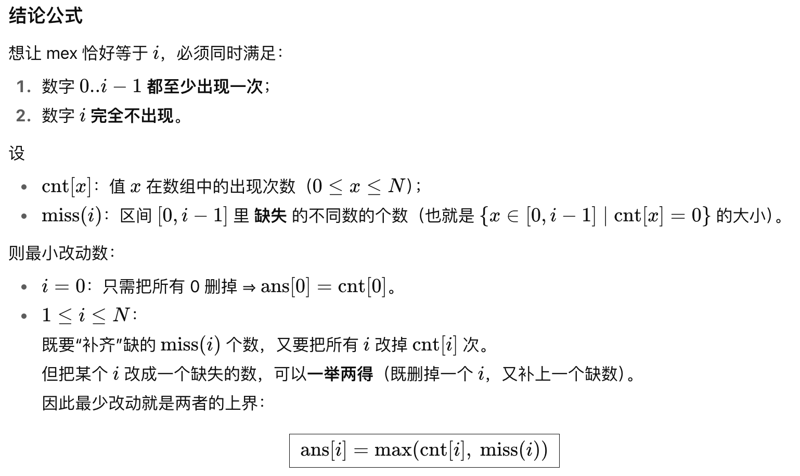
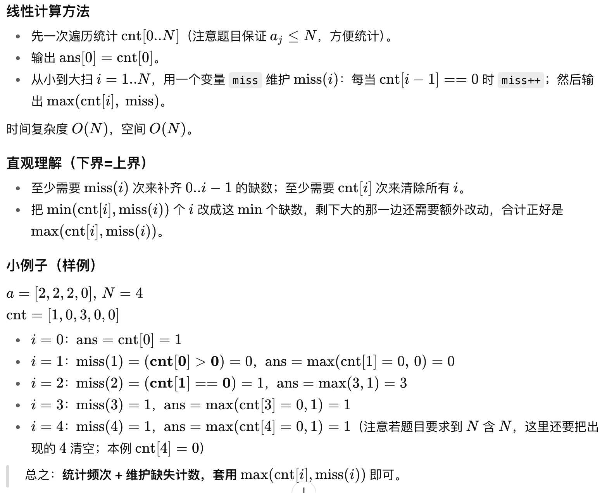

### USACO 2025 February Contest, Gold

### Problem 3. Friendship Editing

> 状态压缩 DP + 集合划分（Set Partition DP）

### 1. 合法图结构

题目的条件是：

> 如果 a,b 是朋友，那么对于任意第三头牛 c，a,c 和 b,c 至少有一条朋友关系。

换句话说，如果：

- a 不认识 b
- b 不认识 c

那么 a 和 c **也一定不能是朋友**。

这意味着：

> “不是朋友”具有传递性。

于是所有牛可以被划分成若干组：

```
组 1: 组内没有任何边
组 2: 组内没有任何边
组 3: 组内没有任何边
...
```

并且不同组之间：

```
所有边都存在
```

也就是说最终图一定是一个：

Complete Multipartite Graph，完全多部图

例如：

```c++
A = {1,2,3}
B = {4,5}
C = {6}
```

最终要求：

```
A 内：无边
B 内：无边
C 内：无边

A-B：全部有边
A-C：全部有边
B-C：全部有边
```

所以问题转化成：

> 把 N 头牛划分成若干集合，使修改边的数量最少

clique：一个集合里的任意两个节点之间都有边。我们现在是在补图上构造clique

### DP 思路

我们需要把所有节点划分成若干个 clique。

先假设：

> 把补图的所有边全部删除。

补图边数就是原图缺失边数：

```c++
dp[0] = N * (N - 1) / 2 - M;
```

### `flip[mask]`

假设让 `mask` 中的节点组成一个 clique。

对于其中每一对 i,j：

### 原图有边

```c++
adj[i][j] == 1
```

意味着补图没边，但 clique 要求有边，所以需要：

+1

### 原图没边

意味着补图本来有边。

我们一开始假设把这条边删除了，但现在它属于 clique，应该保留，所以撤销之前的删除：

−1

因此：

```c++
if (adj[i][j])
    flip[mask]++;
else
    flip[mask]--;
```

`flip[mask]` 表示：

> 把 `mask` 作为一个 clique，相对于“补图全部清空”这个初始方案，代价变化多少。

### 状态转移

定义：

```c++
dp[mask]
```

表示已经把 `mask` 中的节点划分成若干个 clique 的最小代价。

枚举一个子集 `sub` 作为一个 clique：

```c++
for (int sub = mask; sub; sub = (sub - 1) & mask) {
    dp[mask] = min(
        dp[mask],
        dp[mask & ~sub] + flip[sub]
    );
}
```

最终答案：

```
dp[(1 << N) - 1]
```

```c++
#include <algorithm>
#include <cstdio>
const int INF = 1e9 + 7;
int adj[16][16];
int dp[1 << 16];
int N, M;
int flip[1 << 16];
int main() {
    scanf("%d %d", &N, &M);
    // 记录原图
    for (int i = 0; i < M; i++) {
        int U, V;
        scanf("%d %d", &U, &V);
        U--, V--;
        adj[U][V] = adj[V][U] = 1;
    }
    // 预处理：
    // 如果 mask 中所有点组成一个 clique，
    // 相对于“补图所有边全部删除”的 baseline，
    // 代价变化多少？
    for (int mask = 0; mask < (1 << N); mask++) {
        for (int i = 0; i < N; i++) {
            for (int j = i + 1; j < N; j++) {
                // i,j 都属于 mask
                if ((mask & (1 << i)) &&
                    (mask & (1 << j))) {
                    if (adj[i][j]) {
                        // 原图有边
                        // => 补图没边
                        // => clique 需要添加这条边
                        // 需要补+1
                        flip[mask]++;
                    } else {
                        // 原图没边
                        // => 补图已有边
                        // baseline 原计划删除
                        // 现在 clique 要保留
                        // 撤销之前的删除
                        flip[mask]--;
                    }
                }
            }
        }
    }
    // baseline:
    // 把补图中的所有边全部删除
    dp[0] = N * (N - 1) / 2 - M;
    for (int mask = 1; mask < (1 << N); mask++) {
        dp[mask] = INF;
        // 枚举最后一个 clique
        for (int sub = mask;
             sub;
             sub = (sub - 1) & mask) {//枚举mask的非空子集
            //从 mask 里面选出一部分牛，让它们组成一个 clique。
           //dp[{1,2,3,4}]←dp[{1,2}]+flip[{3,4}]
            dp[mask] = std::min(
                dp[mask],
                dp[mask & ~sub] + flip[sub]
            );
        }
    }
    printf("%d\n", dp[(1 << N) - 1]);
}
```

***

### USACO 2025 February Contest, Silver

### Problem 2. Vocabulary Quiz

### 🧠 一、理解题意

### ✅ 1. “有 6 个单词编号为 0…5”

> 意思是程序根据输入关系构造出了 6 个不同的单词（其中第 0 个是空串）。

例如：

```
p = [0, 1, 2, 3, 4]
```

| 单词编号 | 构造规则  | 内容（形式化） |
| -------- | --------- | -------------- |
| 0        | 空串      | ""             |
| 1        | 0 + 字母a | a              |
| 2        | 1 + 字母b | ab             |
| 3        | 2 + 字母c | abc            |
| 4        | 3 + 字母d | abcd           |
| 5        | 4 + 字母e | abcde          |

------

### ✅ 2. “单词 5 是唯一一个不是另一个单词的前缀的单词”

这句话其实在说：

> 只有单词 5 不是任何其他单词的前缀。

换句话说：

- 0 是 1 的前缀；
- 1 是 2 的前缀；
- 2 是 3 的前缀；
- 3 是 4 的前缀；
- 4 是 5 的前缀；
- 但是 5 没有谁以它开头。

👉 所以 5 是一片“叶子节点”🌿（没有孩子）。

------

### ✅ 3. “因此它是词库中唯一的单词”

词库中只包含那些「不是任何单词前缀」的单词，也就是所有叶子节点。
 由于只有 5 是叶子，所以词库 = {5}。

------

### ✅ 4. “一般地说，一旦库中仅剩下一个单词，Elsie 就不再需要任何字符以确定它。”

意思是：

> 当词库里只剩一个单词时，Elsie 一听 Bessie 要读哪个单词，就已经能确定是哪一个，不需要听任何字母。

例如：

- 如果词库里还有多个单词，比如 `{apple, application}`，Elsie 需要听几个字母区分；
- 但如果只剩下 `{apple}` 一个单词，那么无论 Bessie 开口说什么，Elsie 已经知道答案就是 “apple”，所以朗读 0 个字符即可。

### 💡 二、思路

> 树结构模拟 + 前缀判定

### 🧩 1、思路简化

题目看似讲“单词朗读”，
 其实在做的事情是：

> 构造出一棵由单词形成的**树结构（Trie 的压缩版）**，
>  然后依次删除词库中的叶子节点，
>  输出每个被删除节点“被唯一确定”时所需的深度。

换句话说：

> 每个单词就是树中的一个节点；
>  一个单词是另一个单词的前缀 ⇔ 这个单词是另一个节点的**祖先**。
>  所以 “不是任何单词前缀的单词” ⇔ **树的叶子节点**。

### 🌳 2、数据结构建模

###### 题目用 `p[i]` 来描述单词生成关系：

- 单词 0 是空串；
- 单词 `i` = 单词 `p[i]` + 1 个新字符；
- 所以 `p[i]` 是 `i` 的父节点。

因此，我们得到一棵以 0 为根的树。

### 🧠 3、关键观察：

###### “不是前缀的单词” ⇔ “树的叶子节点”

- 若某节点有子节点，则它是别的单词的前缀；
- 若没有子节点（num_child == 0），则它是词库的真实单词。

题目第二部分的输入（M 行）就是这些叶子的顺序。

### ⚙️ 4、算法目标转化

##### 题目问：

> “每次朗读一个单词（=删除叶子）时，Elsie 最少听多少个字符才能唯一确定这个单词？”

对应到树的模型就是：

> 每次删除一个叶子节点时，输出它“与当前树中其他单词分歧的位置深度”。

### 🔍 5、核心逻辑分析

朗读过程对应于**逐步剪去叶子节点**。
 每次操作的逻辑如下：

1. 当前朗读的单词 = 当前树的一个**叶子节点 x**；
2. 如果它的父节点 `P[x]` 只有它这一个孩子（`num_child[P[x]] == 1`）：
   - 那么朗读完后，父节点也会变成新的叶子；
   - Elsie 不需要朗读完整个单词，可以“向上合并”，继续往父节点找；
3. 如果父节点还有别的孩子（有兄弟节点），那么：
   - 此时朗读必须到深度 `length[x]` 才能唯一确定；
   - 然后删除这个节点（父节点孩子数 -1）。

### 🧮 6、算法实现步骤

| 步  骤 | 操作                                              | 说明                                                |
| ------ | ------------------------------------------------- | --------------------------------------------------- |
| 1      | 读入 `N`，和数组 `P`                              | 构建树的父子关系                                    |
| 2      | 遍历 1..N，计算每个节点的 `length` 和 `num_child` | 深度和子节点数                                      |
| 3      | 统计叶子节点个数 M                                | 词库大小                                            |
| 4      | 按输入顺序依次处理每个叶子                        | 模拟朗读过程                                        |
| 5      | 对每个朗读节点执行 while 循环：                   | 若父节点只有它一个子 → 向上合并；否则输出深度并剪枝 |
| 6      | 输出每个单词的朗读长度                            | 对应 Elsie 唯一确定所需字符数                       |

***

```c++
#include <bits/stdc++.h>
using namespace std;

int main() {
    ios::sync_with_stdio(false);
    cin.tie(nullptr);

    int N;
    cin >> N;

    vector<int> P(N + 1);
    for (int i = 1; i <= N; i++)
        cin >> P[i];

    vector<int> num_child(N + 1, 0);
    vector<int> length(N + 1, 0);

    // 计算每个节点的深度与子节点数
    for (int i = 1; i <= N; i++) {
        length[i] = length[P[i]] + 1;
        num_child[P[i]]++;
    }

    // 统计叶子节点数
    int M = 0;
    for (int i = 0; i <= N; i++) {
        if (num_child[i] == 0)
            M++;
    }

    // 模拟 M 次操作
    for (int _ = 0; _ < M; _++) {
        int x;
        cin >> x;

        while (true) {
            assert(num_child[x] == 0);  // 必须是叶子

            if (x == 0) {  // 到达根节点
                cout << 0 << "\n";
                break;
            }

            if (num_child[P[x]] == 1) {
                x = P[x];
                num_child[x] = 0;
                continue;
            }

            cout << length[x] << "\n";
            num_child[P[x]]--;
            break;
        }
    }

    return 0;
}
```

***

### USACO 2025 February Contest, Bronze

### Problem 1. Astral Superposition

题意：画布对称 + 动态单点翻转

思路：核心思路是把整张 `N×N`画布按水平/垂直中线的二重对称分成很多个4 元轨道（orbit）来独立处理。

### 📌 关键观察

- 以中线为界，任意一个格子 `(i,j)` ，及它关于两条中线反射得到的 3 个格子：
  $$
  (i,j),\ (i,\,N-1-j),\ (N-1-i,\,j),\ (N-1-i,\,N-1-j)
  $$
  这 4 个格子构成一个轨道。因为 `N` 是偶数，没有格子落在中线上，所以每个轨道恰有 4 个格子，不同轨道互不相交，覆盖全图。

- 题目要求的“从右上象限镜像到其它象限”本质上要求：每个轨道里的 4 个格子最终必须一致（要么全是‘#’，要么全是‘.’）。
   因为右上象限决定了轨道的最终取值，但对每个轨道我们都可以独立选择成‘#’或‘.’，互不影响。

### 📌 每个轨道的最小代价

- 设某个轨道里当前有 `k`个‘#’（其余 `4-k` 个是‘.’），把这个轨道“全变成同一个字符”的最少操作是：
  $$
  \min(k,\ 4-k)
  $$
  ——要么把这 `k` 个‘#’清掉（变‘.’），要么把那 `4-k` 个‘.’涂上（变‘#’），二者取较小。

### 📌 全局答案与更新

- 初始答案就是所有轨道代价的总和：
   $$
   \sum \min(k_{\text{orbit}}, 4-k_{\text{orbit}})
   $$
   
- 单点翻转更新（把某个 `(r,c)` 的格子‘#’↔‘.’）只会影响它所属的那一个轨道的计数 `k`（`+1` 或 `-1`）。
   做法：
  
  1. 先从总答案里减去该轨道原来的贡献 `min(k,4-k)`；
  2. 按翻转更新该轨道的 `k`；
  3. 再把新的 `min(k,4-k)` 加回总答案。
- 这样每次更新都是 `O(1)`，预处理统计所有轨道的 `k` 是 `O(N^2)`。轨道数是 `(N/2) * (N/2)`。

### 📌 如何给轨道编号（实现小技巧）

把 `(i,j)` 压到它在左上四分之一的代表坐标：
$$
a=\min(i,\,N-1-i),\quad b=\min(j,\,N-1-j)
$$
则 `(a,b)` 唯一确定轨道，可用 `id = a * (N/2)+ b` 索引其计数 `k`。

> **小结：分轨道、每轨道取 `min(k,4-k)`、单点更新只改 一个轨道，整体 `O(N^2+U)`。**

```c++
#include <bits/stdc++.h>
using namespace std;

int main() {
    ios::sync_with_stdio(false);
    cin.tie(nullptr);

    int N, U;
    cin >> N >> U;
    vector<string> g(N);
    for (int i = 0; i < N; ++i) cin >> g[i];

    int H = N / 2;                          // number of orbits per row/col
    auto id_of = [&](int i, int j) -> int { // unique id for the 4-cell orbit
        int a = min(i, N - 1 - i);
        int b = min(j, N - 1 - j);
        return a * H + b;
    };

    // Count '#' in each 4-cell orbit
    vector<int> cnt(H * H, 0);
    for (int i = 0; i < N; ++i) {
        for (int j = 0; j < N; ++j) {
            int id = id_of(i, j);
            if (g[i][j] == '#') ++cnt[id];
        }
    }

    long long answer = 0;
    for (int id = 0; id < H * H; ++id) {
        int k = cnt[id];
        answer += min(k, 4 - k);
    }

    auto output = [&]() {
        cout << answer << '\n';
    };

    output(); // before any updates

    while (U--) {
        int r, c; cin >> r >> c;
        --r; --c; // 0-index

        int id = id_of(r, c);

        // remove old contribution
        answer -= min(cnt[id], 4 - cnt[id]);

        // toggle cell and update count
        if (g[r][c] == '#') {
            g[r][c] = '.';
            --cnt[id];
        } else {
            g[r][c] = '#';
            ++cnt[id];
        }

        // add new contribution
        answer += min(cnt[id], 4 - cnt[id]);

        output();
    }
    return 0;
}

```

### Problem 2. Making Mexes

题意：把数组的 mex 变成每个 `i`的最少改动数。
$$
i∈[0..N]
$$

### 📌 思路：





```c++
#include <bits/stdc++.h>
using namespace std;

int main() {
    ios::sync_with_stdio(false);
    cin.tie(nullptr);

    int N;
    cin >> N;
    vector<long long> cnt(N + 1, 0); // ai in [0..N]

    for (int i = 0; i < N; ++i) {
        int x; cin >> x;
        if (0 <= x && x <= N) ++cnt[x];
        // (x > N cannot happen per constraints, but safe anyway)
    }

    // ans[0] = number of zeros to delete
    cout << cnt[0] << "\n";

    long long miss = 0; // number of j in [0..i-1] with cnt[j] == 0
    for (int i = 1; i <= N; ++i) {
        if (cnt[i - 1] == 0) ++miss;
        // remove all i's, and create all missing values in [0..i-1]
        // each changed i can fill one missing; leftover missing or leftover i's cost extra
        long long ans = max(cnt[i], miss);
        cout << ans << "\n";
    }
    return 0;
}

```

### Problem 3. Printing Sequences

题意：用最多 K 次 `PRINT` + 任意多层 `REP` 生成给定序列

📌 思路：核心思路是把程序看成由两种组合构成：

1. **串联（Concatenation）**：把两个子程序接在一起，所需 `PRINT` 次数相加；
2. **重复（Repetition）**：`REP t (Q)` 把某段子序列整段重复若干次——**不增加** `PRINT` 次数（仍等于 `Q` 的 `PRINT` 叶子数）。

因此，我们只需判断：能否用这两种操作把目标序列拼出来，使得**叶子（`PRINT x`）的数量 ≤ K**。这转化为一个区间 DP。

------

#### 区间 DP 设计

- 设序列为 `a[0..N-1]`（N ≤ 100, K ≤ 3）。
- 定义 `dp[l][r]`：构造子序列 `a[l..r]` 所需最少 `PRINT` 数（即最少叶子数）。

#### 初始与转移

- **基底（全相同段）**：如果 `a[l..r]` 全部相同（值随便，只要一致），可以：

  ```
  REP (r-l+1)
      PRINT a[l]
  END
  ```

  只需 **1** 次 `PRINT`，所以 `dp[l][r] = 1`。

- **串联**：对任意切分点 `k`（`l ≤ k < r`）：
  $$
  dp[l][r] = \min\big(dp[l][k] + dp[k+1][r]\big)
  $$

- **重复压缩**：若 `a[l..r]` 可由某个**基模式** `a[l..l+p-1]` 重复整齐铺满（`len = r-l+1`，且 `len % p == 0`，并且每个块都与基模式相同），则
  $$
  dp[l][r] = \min\big(dp[l][r],\ dp[l][l+p-1]\big)
  $$
  ——外层包一层 `REP (len/p)`，`PRINT` 叶子数**不变**。

### 判定

- 最终判断 `dp[0][N-1] ≤ K` 则输出 YES，否则 NO。

------

#### 复杂度与实现细节

- 直接实现：
  - 预处理 `allSame[l][r]` 判断区间是否全相同（O(N²)）。
  - 枚举长度 `len`，枚举区间 `(l,r)`（O(N²)），
    - 枚举切分点 `k`（O(N)），
    - 枚举基模式长度 `p`（O(N)），并逐位比对是否整齐重复（最坏 O(N)）。
  - 粗略上界 O(N³)～O(N⁴)，但 N=100 完全可过；实践中可把“检查整齐重复”在循环里做线性比对，整体 **O(N³)** 足够。
- 小优化：
  - 在 DP 中一旦某个 `dp[l][r]` 已经 ≤ K，就没必要继续尝试更差的转移（剪枝）。
  - “整齐重复”的检查可以用哈希 / Z 函数 / KMP 前缀函数加速到均摊 O(1) 判断，但对 N=100 没必要。

一句话总结：

> 用区间 DP 求“最少 `PRINT` 叶子数”，转移包含**串联**与**整段重复压缩**；最后判断是否 ≤ K。

```c++
#include <bits/stdc++.h>
using namespace std;

int main() {
    ios::sync_with_stdio(false);
    cin.tie(nullptr);

    int T;
    cin >> T;
    while (T--) {
        int N, K;
        cin >> N >> K;
        vector<int> a(N);
        for (int i = 0; i < N; ++i) cin >> a[i];

        const int INF = 1e9;
        vector<vector<int>> dp(N, vector<int>(N, INF));
        vector<vector<bool>> allSame(N, vector<bool>(N, false));

        // Precompute allSame
        for (int l = 0; l < N; ++l) {
            allSame[l][l] = true;
            for (int r = l + 1; r < N; ++r) {
                allSame[l][r] = allSame[l][r - 1] && (a[r] == a[l]);
            }
        }

        // Helper to check if a[l..r] == k repeats of a[l..l+p-1]
        auto isRepeat = [&](int l, int r, int p) -> bool {
            int len = r - l + 1;
            if (p <= 0 || len % p) return false;
            for (int i = l + p; i <= r; ++i) {
                if (a[i] != a[l + (i - l) % p]) return false;
            }
            return true;
        };

        for (int len = 1; len <= N; ++len) {
            for (int l = 0; l + len - 1 < N; ++l) {
                int r = l + len - 1;

                // If all equal -> 1 PRINT with a REP
                if (allSame[l][r]) {
                    dp[l][r] = 1;
                }

                // Concatenation
                for (int k = l; k < r; ++k) {
                    dp[l][r] = min(dp[l][r], dp[l][k] + dp[k + 1][r]);
                }

                // Repetition (use smaller base pattern if it tiles the whole segment)
                for (int p = 1; p < len; ++p) { // p = base pattern length
                    if (isRepeat(l, r, p)) {
                        dp[l][r] = min(dp[l][r], dp[l][l + p - 1]);
                    }
                }
            }
        }

        cout << (dp[0][N - 1] <= K ? "YES" : "NO") << "\n";
    }
    return 0;
}

```

