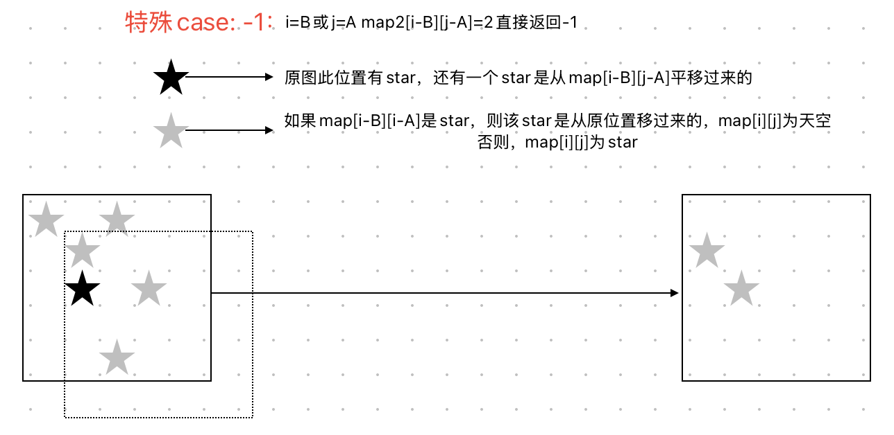

## USACO 2025 January Contest, Silver

### Problem 1. Cow Checkups

题意：组合计数 / 区间枚举优化

思路：**一次反转区间后，匹配 `a_{p(i)}=b_i` 的总次数，累加所有 `[l,r]`**。

- `A[j]`：原队列第 `j` 头牛的种类；

- `B[i]`：医生希望第 `i` 个位置检查的种类；

- 反转一段 `[l,r]` 后，第 `i` 个位置来自
  $$
  p(i)=\begin{cases}
  i,& i\notin[l,r]\\
  l+r-i,& i\in[l,r].
  \end{cases}
  $$

对每对位置 `(j,i)`（原数组位置 `j`，目标位置 `i`），当且仅当 `a_j=b_i` 时，这对 `(j,i)` 会被某些区间 `[l,r]` 把 `j` 放到 `i`。把这些区间个数求出来并相加，就是答案。
$$
\sum_{j=1}^N\sum_{i=1}^N [A_j=B_i]\cdot \textsf{cnt}(j,i).
$$
cnt(j,i) 分两类：

- **不含 j** 的段：只在 i=j 时计数，数量为
  $$
  \underbrace{\binom{j}{2}+\binom{N-j-1}{2}}_{\text{完全在左/右}}+\underbrace{\min(j,\,N-j-1)+1}_{\text{以 \(i\) 为中心的对称段}}.
  $$
  这正是代码里当 `A[i]=B[i]` 时的那一行（0-based 写成 `ways2(i)+ways2(N-1-i)+min(i,N-1-i)+1`）。

  > 当我们把区间 `[l,r]` 反转时，位置 `i` 的元素会去到位置 `p(i)=l+r-i`。
  >  要让反转后**仍然在位置 `i`**（也就是 `p(i)=i`），必须满足
  > $$
  > l+r=2i.
  > $$
  > 这类区间就是“**以 `i` 为中心的对称段**”：左右端点到 `i` 的距离相等，即形如
  > $$
  > [l,r]=[\,i-k,\ i+k\,],\quad k\ge 0.
  > $$
  > 它们的长度都是奇数（`2k+1`），真正对称地“绕着 `i`”翻转，翻完 `i` 位置的元素没有变位置。
  >
  > ### 有多少个这样的对称段？
  >
  > 受数组边界限制，`k` 最大不能超过左边可伸出的 `i` 和右边可伸出的 `N-1-i`（0 下标）。
  >  所以
  > $$
  > k=0,1,\dots,\min\big(i,\ N-1-i\big),
  > $$
  > **个数 = **min(i,N−1−i)+1**。
  >
  > - **0-based 索引**：个数 min(i,N−1−i)+1。
  > - **1-based 索引**（位置从 1 到 N）：个数 min(i−1,N−i)+1。

- **包含 j** 的区间：这时 `i=l+r-j`。把所有合法 `[l,r]` 数出来，得到一个只与 `j,i` 的简单式，0-based写法是

$$
\boxed{\ \text{cnt\_in}(j,i)=
  \begin{cases}
    \min(j+1,\ N-i), & i\ge j,\\[2pt]
    \min(N-j,\ i+1), & i<j~.
  \end{cases}
}
$$

```c++
#include <bits/stdc++.h>
using namespace std;
 
#define all(x) begin(x), end(x)
#define FOR(i, a, b) for (int i = (a); i < (b); ++i)
#define F0R(i, a) FOR(i, 0, a)
 
using ll = int64_t;
 
int main() {
    ios::sync_with_stdio(false);
    cin.tie(nullptr);
    int N;
    cin >> N;
    vector<int> A(N), B(N);
    for (int &x : A) cin >> x;
    for (int &x : B) cin >> x;
    auto ways2 = [&](ll x) { return x * (x + 1) / 2; };
    ll ans = 0;
    F0R(i, N) if (A[i] == B[i]) {
        ans += ways2(i) + ways2(N - 1 - i) + min(i, N - 1 - i) + 1;
    }
    F0R(_, 2) {
        vector<vector<pair<int, int>>> with_oc(N + 1);
        F0R(i, N) {
            with_oc.at(B.at(i)).push_back({i, 1});// 记录：值 v=B[i] 在 B 里的出现 (i)
            with_oc.at(A.at(i)).push_back({i, 0});// 记录：值 v=A[i] 在 A 里的出现 (i)
        }
       //把 B[i] 的这次出现，作为 (i,1) 放进 with_oc[B[i]]；
       //把 A[i] 的这次出现，作为 (i,0) 放进 with_oc[A[i]]。
       //A=[2,1,2], B=[1,2,2]，则
       //with_oc[1] = {(1,0), (0,1)} // A中1在j=1，B中1在i=0
       //with_oc[2] = {(0,0),(2,0),(1,1),(2,1)} // A中2在j=0,2；B中2在i=1,2
        FOR(v, 1, N + 1) {
            reverse(all(with_oc.at(v)));
            stack<int> stk;
            int num_large = 0;
            ll sum_small = 0;
            auto query = [&](int x) {
                while (!stk.empty() && stk.top() > x) {
                    ++num_large;
                    sum_small -= stk.top();
                    stk.pop();
                }
                return sum_small + (ll)num_large * x;
            };
            for (auto [idx, which] : with_oc.at(v)) {
                if (which == 0) {
                    ans += query(idx + 1);
                } else {
                    int v = N - idx;
                    sum_small += v;
                    stk.push(v);
                }
            }
        }
        reverse(all(A));
        reverse(all(B));
    }
    cout << ans << "\n";
}
```

***

## USACO 2025 January Contest, Bronze

### Problem 1. Astral Superposition

题意： 一个N✖️N方格，每个方格可能会有一个星星。经过变化后，原来的星星可能会消失，也可能会向右移动A、再向下移动B。如果星星移动出界或消失，那么就不会出现在第二张照片。现在两张照片重叠，如果没有星星，显示White。如果一个星星，显示Gray，如果两个星星，显示Black。现在给出重叠后的影像，以及A，B值，求第一张图的最小星星数。

思路：

```Python
WGB={
    'W':0,
    'G':1,
    'B':2,
}
def _case():
    N,A,B=[int(x) for x in input().split()]
    map3=[[WGB[x] for x in input()] for _ in range(N)]
    map1=[[0 for _ in range(N)] for _ in range(N)]
   
    for i in range(N):
        for j in range(N):
            if map3[i][j]==2:
                map1[i][j]=1
                if i<B or j<A:
                    print(-1)
                    return 
                if map3[i-B][j-A]==0:
                    print(-1)
                    return
                map1[i-B][j-A]=1
    
    for i in range(N):
        for j in range(N):
            if map3[i][j]==1:
                if map1[i][j]==1:
                    continue
                if i<B or j<A:
                    map1[i][j]=1
                    continue
                if map1[i-B][j-A]==1:
                    continue
                map1[i][j]=1

    print(sum(sum(x) for x in map1))

T=int(input())
while T:
    T-=1
    _case()
```

```c++
#include <bits/stdc++.h>
using namespace std;

int cv(char c) { // 'W','G','B' -> 0,1,2
    if (c == 'W') return 0;
    if (c == 'G') return 1;
    return 2; // 'B'
}

void solve_case() {
    int N, A, B;
    if (!(cin >> N >> A >> B)) return;

    vector<vector<int>> map3(N, vector<int>(N));
    for (int i = 0; i < N; ++i) {
        string s; cin >> s;               // 长度为 N 的 W/G/B 字符串
        for (int j = 0; j < N; ++j)
            map3[i][j] = cv(s[j]);
    }

    vector<vector<int>> map1(N, vector<int>(N, 0));

    // 第一轮：处理 'B'（值 2）
    for (int i = 0; i < N; ++i) {
        for (int j = 0; j < N; ++j) {
            if (map3[i][j] == 2) {
                map1[i][j] = 1;
                if (i < B || j < A) {            // 越界
                    cout << -1 << '\n';
                    return;
                }
                if (map3[i - B][j - A] == 0) {   // 对应位置是 'W'
                    cout << -1 << '\n';
                    return;
                }
                map1[i - B][j - A] = 1;
            }
        }
    }

    // 第二轮：处理 'G'（值 1）
    for (int i = 0; i < N; ++i) {
        for (int j = 0; j < N; ++j) {
            if (map3[i][j] == 1) {
                if (map1[i][j] == 1) continue;
                if (i < B || j < A) {            // 放自己
                    map1[i][j] = 1;
                    continue;
                }
                if (map1[i - B][j - A] == 1) continue;
                map1[i][j] = 1;
            }
        }
    }

    long long ans = 0;
    for (int i = 0; i < N; ++i)
        for (int j = 0; j < N; ++j)
            ans += map1[i][j];

    cout << ans << '\n';
}

int main() {
    int T; 
    cin>>T;
    while (T--) solve_case();
    return 0;
}
//vector<vector<int>>二维数组
//把字符转换成数字存储
//分解问题，找出解题点
```

### Problem 2. It's Mooin' Time II

题意：a2,…,aNa1,a2,…,aN，哞哞叫abb。

```python
N=int(input())
nums=[int(x) for x in input().split()]

cnt=[0]*(N+1)
right=[0]*(N+1)
diff=0
ans=0

for i in range(N):
    right[nums[i]]+=1

for i in range(N):
    if right[nums[i]]==2:
        ans+=diff-(cnt[nums[i]]>0)
    right[nums[i]]-=1
    diff+=cnt[nums[i]]==0
    cnt[nums[i]]+=1

print(ans)
```

```c++
#include <bits/stdc++.h>
using namespace std;

int main() {
    ios::sync_with_stdio(false);
    cin.tie(nullptr);

    int N;
    cin >> N;
    vector<int> nums(N);
    for (int i = 0; i < N; ++i) cin >> nums[i];

    vector<int> left(N + 1, 0), right(N + 1, 0);
    long long ans = 0;
    int distinct_left = 0;

    // 统计每个值总出现次数（放到 right）
    for (int i = 0; i < N; ++i) right[nums[i]]++;

    for (int i = 0; i < N; ++i) {
        int v = nums[i];
        if (right[v] == 2) {
            // 在倒数第二次出现的位置结算
            ans += (long long)distinct_left - (left[v] > 0 ? 1 : 0);
        }
        right[v] -= 1;
        distinct_left += (left[v] == 0 ? 1 : 0);
        left[v] += 1;
    }

    cout << ans << '\n';
    return 0;
}

```

### Problem 3. Cow Checkups

题意：N头牛的排列顺序是a1,a2,…,aN，医生需每头牛与其对应的b1,b2,…,bN相同才为其医治。输出N+1行，每行使得 i−1 头奶牛被检查的操作数量。

思路：1️⃣ 先计算原始 same = `sum(A[i]==B[i])`。
 2️⃣ 对每个中心 mid ，向两边扩展（相当于模拟所有可能反转区间）。
 每次交换两端 A[l],A[r] 后更新匹配数 _same：
     _same -= (A[l]==B[l]) + (A[r]==B[r]) # 撤销旧位置的匹配
     _same += (A[l]==B[r]) + (A[r]==B[l]) # 添加交换后新匹配
 然后 ans[_same] ++
 双重调用 expand(mid,mid) (奇数长度) 和 expand(mid,mid+1) (偶数长度)。

```python
def main():
    n = int(input())
    A = list(map(int, input().split()))
    B = list(map(int, input().split()))

    same=sum(1 for i in range(n) if A[i]==B[i])
    ans=[0]*(n+1)

    def expand(l,r):
        nonlocal same
        _same=same
        while l>=0 and r<n:
            _same-=(A[l]==B[l])+(A[r]==B[r])
            _same+=(A[l]==B[r])+(A[r]==B[l])
            ans[_same]+=1
            l-=1
            r+=1

    for mid in range(n):
        expand(mid,mid)
        expand(mid,mid+1)
    
    for res in ans:
        print(res)

if __name__ == "__main__":
    main()
```

```c++
#include <bits/stdc++.h>
using namespace std;

int main() {
    ios::sync_with_stdio(false);
    cin.tie(nullptr);

    int n;
    cin >> n;
    vector<int> A(n), B(n);
    for (int i = 0; i < n; ++i) cin >> A[i];
    for (int i = 0; i < n; ++i) cin >> B[i];

    int same = 0;
    for (int i = 0; i < n; ++i) if (A[i] == B[i]) ++same;

    vector<long long> ans(n + 1, 0);

    auto expand = [&](int l, int r) {
        int _same = same;  // 局部工作副本
        while (l >= 0 && r < n) {
            _same -= (A[l] == B[l]) + (A[r] == B[r]);
            _same += (A[l] == B[r]) + (A[r] == B[l]);
            ++ans[_same];
            --l; ++r;
        }
    };

    for (int mid = 0; mid < n; ++mid) {
        expand(mid, mid);       // 奇数长度
        expand(mid, mid + 1);   // 偶数长度
    }

    for (long long v : ans) {
        cout << v << endl;
    }
    return 0;
}

```

