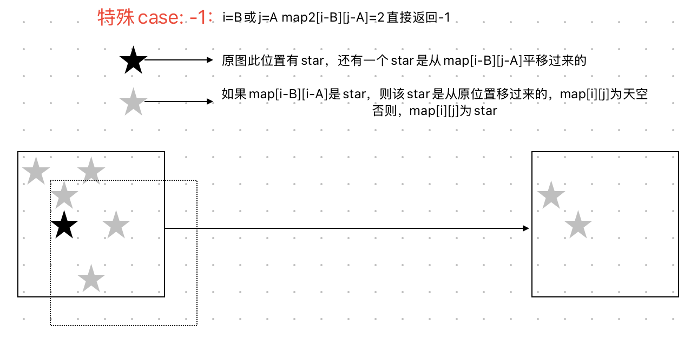

## USACO 2025 January Contest, Silver

### Problem 1. Cow Checkups

### 🧩 题意：组合计数 / 区间枚举优化

思路：**一次反转区间后，匹配 `a_{p(i)}=b_i` 的总次数，累加所有 `[l,r]`**。

- `A[j]`：原队列第 `j` 头牛的种类；

- `B[i]`：医生希望第 `i` 个位置检查的种类；

- 反转一段 `[l,r]` 后，第 `i` 个位置来自
  $$
  p(i)=\begin{cases}
  i,& i\notin[l,r]\\
  l+r-i,& i\in[l,r].
  \end{cases}
  $$

对每对位置 `(j,i)`（原数组位置 `j`，目标位置 `i`），当且仅当 `a_j=b_i` 时，这对 `(j,i)` 会被某些区间 `[l,r]` 把 `j` 放到 `i`。把这些区间个数求出来并相加，就是答案。
$$
\sum_{j=1}^N\sum_{i=1}^N [A_j=B_i]\cdot \textsf{cnt}(j,i).
$$
cnt(j,i) 分两类：

- **不含 j** 的段：只在 i=j 时计数，数量为
  $$
  \underbrace{\binom{j}{2}+\binom{N-j-1}{2}}_{\text{完全在左/右}}+\underbrace{\min(j,\,N-j-1)+1}_{\text{以 \(i\) 为中心的对称段}}.
  $$
  这正是代码里当 `A[i]=B[i]` 时的那一行（0-based 写成 `ways2(i)+ways2(N-1-i)+min(i,N-1-i)+1`）。

  > 当我们把区间 `[l,r]` 反转时，位置 `i` 的元素会去到位置 `p(i)=l+r-i`。
  >  要让反转后**仍然在位置 `i`**（也就是 `p(i)=i`），必须满足
  > $$
  > l+r=2i.
  > $$
  > 这类区间就是“**以 `i` 为中心的对称段**”：左右端点到 `i` 的距离相等，即形如
  > $$
  > [l,r]=[\,i-k,\ i+k\,],\quad k\ge 0.
  > $$
  > 它们的长度都是奇数（`2k+1`），真正对称地“绕着 `i`”翻转，翻完 `i` 位置的元素没有变位置。
  >
  > ### 有多少个这样的对称段？
  >
  > 受数组边界限制，`k` 最大不能超过左边可伸出的 `i` 和右边可伸出的 `N-1-i`（0 下标）。
  >  所以
  > $$
  > k=0,1,\dots,\min\big(i,\ N-1-i\big),
  > $$
  > **个数 = **min(i,N−1−i)+1**。
  >
  > - **0-based 索引**：个数 min(i,N−1−i)+1。
  > - **1-based 索引**（位置从 1 到 N）：个数 min(i−1,N−i)+1。

- **包含 j** 的区间：这时 `i=l+r-j`。把所有合法 `[l,r]` 数出来，得到一个只与 `j,i` 的简单式，0-based写法是

$$
\boxed{\ \text{cnt\_in}(j,i)=
  \begin{cases}
    \min(j+1,\ N-i), & i\ge j,\\[2pt]
    \min(N-j,\ i+1), & i<j~.
  \end{cases}
}
$$

```c++
#include <bits/stdc++.h>
using namespace std;
 
#define all(x) begin(x), end(x)
#define FOR(i, a, b) for (int i = (a); i < (b); ++i)
#define F0R(i, a) FOR(i, 0, a)
 
using ll = int64_t;
 
int main() {
    ios::sync_with_stdio(false);
    cin.tie(nullptr);
    int N;
    cin >> N;
    vector<int> A(N), B(N);
    for (int &x : A) cin >> x;
    for (int &x : B) cin >> x;
    auto ways2 = [&](ll x) { return x * (x + 1) / 2; };
    ll ans = 0;
    F0R(i, N) if (A[i] == B[i]) {
        ans += ways2(i) + ways2(N - 1 - i) + min(i, N - 1 - i) + 1;
    }
    F0R(_, 2) {
        vector<vector<pair<int, int>>> with_oc(N + 1);
        F0R(i, N) {
            with_oc.at(B.at(i)).push_back({i, 1});// 记录：值 v=B[i] 在 B 里的出现 (i)
            with_oc.at(A.at(i)).push_back({i, 0});// 记录：值 v=A[i] 在 A 里的出现 (i)
        }
      //把它们丢进同一个桶 with_oc[v]，之后“按下标顺序混合”扫描，就能流式地把所有 (j,i) 的那一部分 累加    掉，而不需要双重循环。
       //A=[2,1,2], B=[1,2,2]，则
       //with_oc[1] = {(1,0), (0,1)} // A中1在j=1，B中1在i=0
       //with_oc[2] = {(0,0),(2,0),(1,1),(2,1)} // A中2在j=0,2；B中2在i=1,2
        FOR(v, 1, N + 1) {
            reverse(all(with_oc.at(v)));
            stack<int> stk; // 存当前所有 t（单调不减）
            int num_large = 0; // 被“按 x 记”的个数（那些 >x 的 t）
            ll sum_small = 0; // ≤x 的 t 之和
            auto query = [&](int x) {
                while (!stk.empty() && stk.top() > x) {
                    ++num_large;
                    sum_small -= stk.top();
                    stk.pop();
                }
                return sum_small + (ll)num_large * x; // = Σ min(t,x)
            };
            for (auto [idx, which] : with_oc.at(v)) {
                if (which == 0) {
                    ans += query(idx + 1);
                } else {
                    int v = N - idx;
                    sum_small += v;
                    stk.push(v);
                }
            }
        }
        reverse(all(A));
        reverse(all(B));
    }
    cout << ans << "\n";
}
//单调栈
//流式存储 流式扫描 pair函数
//way2
//思路
```

## 用一个小例子具体走一遍

取 `N=4`：

- `A=[2,1,2,1]`
- `B=[1,2,1,2]`

把“值等于 1、2”的出现按**同一条下标时间线**收集进桶（注意代码是按 `i=0..N-1` 依次把 `B[i]`、`A[i]` 放进去，因此**反转后**就是**按下标递减**的混合序列）：

- 对值 `v=1`：
  - 原顺序 `with_oc[1] = [(0,1),(1,0),(2,1),(3,0)]`
     （`(idx,which)`，`which=1` 表示来自 B，`which=0` 表示来自 A）
  - 反转后 `[(3,0),(2,1),(1,0),(0,1)]` ——下标依次 3,2,1,0（从右往左）
- 对值 `v=2`：
  - 原顺序 `[(0,0),(1,1),(2,0),(3,1)]`
  - 反转后 `[(3,1),(2,0),(1,1),(0,0)]`

### 先看 `v=1` 这一桶（第一趟，不反转 A/B）

我们维护一个“∑min”的**单调栈**：遇到 B 的 `i` 压入 `t=N-i`；遇到 A 的 `j` 就查询 `query(x=j+1)`，返回当前所有 `t` 的 ∑min(t,x)。

序列 `[(3,0),(2,1),(1,0),(0,1)]` 依次处理：

1. `(3,0)`：A 的 `j=3`。此时还没见到任何 B ⇒ 贡献 0。
2. `(2,1)`：B 的 `i=2`。压入 `t=N-i=4-2=2`。
3. `(1,0)`：A 的 `j=1`。此时“已入库的 B”只有 `i=2`，所以计算
    min(N−i, j+1)=min(2,2)=2，加 2。
4. `(0,1)`：B 的 `i=0`。压入 `t=4-0=4`（留给后面别的`j` 用）。

这一桶在第一趟贡献了 2；它正是
$$
\sum_{\substack{A[j]=B[i]=1\\ i\ge j}} \min(N-i,\ j+1)
= \min(4-2,1+1)=2.
$$

> 关键：我们**没用双重循环**枚举 $(j,i)$；只是“混合扫描一次”，每遇到一个 `j`，用当前栈里所有 `t` 统一算了一次 $\sum \min$。而“栈 + 反向扫描”保证这就是“所有 $i\ge j$”那部分的和。

### 再看 `v=2` 这一桶（第一趟）

序列 `[(3,1),(2,0),(1,1),(0,0)]`：

1. `(3,1)`：B 的 `i=3`。压入 `t=4-3=1`。
2. `(2,0)`：A 的 `j=2`。此时“已入库 B”只有 $i=3$，加 $\min(4-3,2+1)=1$。
3. `(1,1)`：B 的 `i=1`。压入 `t=3`。
4. `(0,0)`：A 的 `j=0`。此时“已入库 B”为 `i=3,1`；
    $\min(4-3,0+1)+\min(4-1,0+1)=\min(1,1)+\min(3,1)=1+1=2$。

这一桶第一趟贡献 $1+2=3$，等于
$$
\sum_{\substack{A[j]=B[i]=2\\ i\ge j}} \min(N-i,\ j+1)
= \min(1,3)+\min(3,1)=1+1=2 \quad(\text{对 } j=0)
+ \min(1,3)=1\quad(\text{对 } j=2)
$$

### 第二趟（把 A、B 整体反转后，再做同样的流程）

会对每个值把**另一半**（$i 的部分）
$$
\sum \min(N-j,\ i+1)
$$
累加上。原因是反转后索引变换 `i'=N-1-i,\ j'=N-1-j`，这趟仍然做“遇 B 入 `t'=N-i'=i+1`，遇 A 查 `x'=j'+1=N-j`”且只覆盖 `i'\ge j'`（也就是原来的 $i）。

两趟相加，就把
$$
\text{cnt\_in}(j,i)=
\begin{cases}
\min(N-i,\ j+1), & i\ge j,\\
\min(N-j,\ i+1), & i<j
\end{cases}
$$
对**所有** `(j,i)`（且 `A[j]=B[i]`）的贡献都加完了。

### Problem 2. Cow Checkups

### 🧩 题意：

Farmer John 有一个数组 `a[1..N]` 和一个整数 `M`。
 他想通过 **对数组元素加 1 或减 1**，使得

> 对于所有 `i`，都有 `(a[i] - x)` 能被 `M` 整除。

我们要求出：
 对于所有可能的整数 `x`，FJ 需要的**最少操作次数**（每加 1 或减 1 记作一次操作）。

### 🎯 问题转化

我们可以把问题换个角度看。

对于每个 `a[i]`，我们要调整它，使得：

```c++
a[i] ≡ x (mod M)
```

也就是 `a[i]` 和 `x` 在模 `M` 意义下相等。

换句话说，`a[i] % M` 应该与 `x % M` 相同。
 因此我们可以定义：

```c++
resid[i] = a[i] % M
```

FJ 想让所有元素的余数都等于 `x % M`。

### 🧮 计算「最少操作次数」

我们可以把 `a[i]` 调整到**最近的那个数**，使得它对 `M` 取余后等于 `x`。

### 举个例子：

假设 `M = 9`，`a[i] = 15`，`x = 3`。

我们要让 `(a[i] - x)` 是 `9` 的倍数。
 也就是让 `a[i] ≡ 3 (mod 9)`。

`15 mod 9 = 6`
 要从 6 变成 3，有两种办法：

1. **往下调**：从 6 → 3，差 3。
2. **往上调**：从 6 → 3 + 9 = 12，多了 6。

取较小的那个（3），所以最少要操作 3 次。

### ✳️ 通用公式

对于每个 `a[i]` 和某个余数目标 `x`：

```c++
delta = abs(resid[i] - x)
cost_i = min(delta, M - delta)
```

为什么要取 `min(M - delta)` 呢？

因为模循环下，比如 `M = 9` 时：

- `resid[i] = 8`, `x = 1`
  - 直接差距 `|8 - 1| = 7`
  - 但是你可以往上加 2（因为 8→9→0→1）
  - 所以实际最小步数是 `min(7, 9 - 7 = 2) = 2`

所以：

```c++
cost_i = min(|resid[i] - x|, M - |resid[i] - x|)
```

### 💡总操作数

FJ 的无聊值（总操作次数）：

```
sum_i cost_i
```

我们要对所有可能的 `x`（`0 ≤ x < M`）计算上面的值，取最小。

代码：

```c++
#include <bits/stdc++.h>
using namespace std;
using int64 = long long;

/*
解法：
  - 把余数排序，复制一份加上 M（展开圆环成直线）。
  - 用双指针维护一个窗口 [k..j]，满足 r2[j] - r2[k] <= M/2。
    对窗口内的点，直接差值；窗口外的点，差值取 M - (r - t)。
  - 用前缀和快速计算差值总和。
  - 枚举每个 r2[k] 作为候选 t，取最小值。
复杂度：
  排序 O(N log N)，双指针扫描 O(N)，适合 N ≤ 2e5。
*/

long long solve_case(int N, long long M, vector<long long>& A) {
    // 1. 计算余数
    vector<long long> r(N);
    for (int i = 0; i < N; i++) {
        r[i] = A[i] % M;
    }
    sort(r.begin(), r.end());

    // 2. 复制一份 +M
    vector<long long> r2(2 * N);
    for (int i = 0; i < N; i++) {
        r2[i] = r[i];
        r2[i + N] = r[i] + M;
    }

    // 3. 前缀和
    vector<long long> pref(2 * N + 1, 0);
    for (int i = 0; i < 2 * N; i++) {
        pref[i + 1] = pref[i] + r2[i];
    }
    long long ans = LLONG_MAX;
    int j = 0;
    double half = M / 2.0;

    // 4. 枚举每个起点 k
    for (int k = 0; k < N; k++) {
        if (j < k) j = k;
        // 扩展 j，保证区间长度 <= M/2
        while (j + 1 < k + N && (r2[j + 1] - r2[k]) <= half) {
            j++;
        }

        int cnt1 = j - k + 1; // 窗口内元素个数
        long long sum1 = (pref[j + 1] - pref[k]) - 1LL * cnt1 * r2[k];
        // 窗口外元素个数
        int cnt2 = N - cnt1;
        long long sum_right = (pref[k + N] - pref[j + 1]);
        // 窗口外距离公式：cnt2*M - (sum_right - cnt2 * r2[k])
        long long sum2 = 1LL * cnt2 * M - (sum_right - 1LL * cnt2 * r2[k]);

        long long total = sum1 + sum2;
        ans = min(ans, total);
    }

    return ans;
}

int main() {
    ios::sync_with_stdio(false);
    cin.tie(nullptr);

    int T;
    cin >> T;
    while (T--) {
        int N;
        long long M;
        cin >> N >> M;
        vector<long long> A(N);
        for (int i = 0; i < N; i++) cin >> A[i];

        cout << solve_case(N, M, A) << "\n";
    }
    return 0;
}

```

### Problem 3. Transforming Pairs

### 🧩 题意：

- 初始有两个堆：`(a, b)`。
- 操作有两种：
  1. 把 pile1 增加 pile2 的大小 → `(a+b, b)`
  2. 把 pile2 增加 pile1 的大小 → `(a, a+b)`
- 要问能否经过若干步操作得到 `(c, d)`，如果能，要最少多少步。

### 🎯 观察

1. **只能增大，不能减少**
    如果 `c < a` 或 `d < b`，直接不可能。

2. **增长模式类似斐波那契**
    每次操作是“加上对方”。这和欧几里得算法是逆过程。
    比如 `(5,3)` 变 `(8,3)` 或 `(5,8)`，很像 gcd 的“减法版”。

3. **不可达情况**
    如果 gcd 不一致，就不可能。
    因为每次操作相当于线性组合：最终 `(c,d)` 必须满足

   ```
   gcd(c, d) == gcd(a, b)
   ```

   否则答案是 -1。

4. **最少步数**
    要从 `(a,b)` 走到 `(c,d)`，就是模拟“反向欧几里得算法”：

   - 从 `(c,d)` 倒推回 `(a,b)`
   - 每次把大的减去小的（但允许一次性减很多倍，相当于快速跳过）。

### 📌 Case1: 初始 `(5,3)` → 目标 `(8,19)`。

- 目标 gcd(8,19) = 1，初始 gcd(5,3)=1 ✅可行。

- 倒推：

  ```
  (8,19) → (8,11) → (8,3) → (5,3)
  ```

- 总共 3 步。

### 📌 Case2: 初始 `(5,3)` → 目标 `(19,8)`。

- gcd(19,8)=1，gcd(5,3)=1 ✅可行。
- 倒推时发现 `(19,8)` → `(11,8)` → `(3,8)`，但 `(3,8)` gcd=1，已经小于 `(5,3)`，回不去了 ❌。
- 所以答案 `-1`。

📌 Case3: 初始 `(5,3)` → 目标 `(5,3)`。

- 直接相等，答案 `0`。

***

### ✳️ 解题算法（反向模拟）

1. 如果 `c < a or d < b` → `-1`
2. 如果 `gcd(c, d) != gcd(a, b)` → `-1`
3. 否则，从 `(c,d)` 开始反推到 `(a,b)`：
   - 如果 `c > d`，则 `c -= k*d`
   - 如果 `d > c`，则 `d -= k*c`
   - 其中 `k` 取尽量大的，使得 `c,d` 不小于目标 `(a,b)`。
   - 统计步数。
4. 如果最终能到 `(a,b)`，输出步数，否则 `-1`。

```c++
#include <bits/stdc++.h>
using namespace std;
using int64 = long long; // 题目范围 1 ≤ a,b,c,d ≤ 1e18

// 处理单个测试用例
long long solve(long long a, long long b, long long c, long long d) {
    long long res = 0;
    while (true) {
        // 如果已经到达目标
        if (a == c && b == d) return res;

        // 确保 c >= d，否则交换两堆（对应 Python 里的 if c < d: swap）
        if (c < d) {
            swap(a, b);
            swap(c, d);
        }

        // 不可能情况
        if (a > c || b > d || d == 0) return -1;

        // 如果 b == d，可以直接检查 c 是否能通过加若干次 d 变成目标
        if (b == d && (c - a) % d == 0) {
            res += (c - a) / d;//只需检查 (c - a) 是否能整除 d，能的话一次算出多少步。
            return res;
        }
        // 否则，做一次类似 "c %= d" 的大步跳跃
        res += c / d;
        c %= d;
    }
    return res;
}

int main() {
    ios::sync_with_stdio(false);
    cin.tie(nullptr);

    int T;
    cin >> T;
    while (T--) {
        long long a, b, c, d;
        cin >> a >> b >> c >> d;
        cout << solve(a, b, c, d) << "\n";
    }
    return 0;
}

```

***

## USACO 2025 January Contest, Bronze

### Problem 1. Astral Superposition

题意： 一个N✖️N方格，每个方格可能会有一个星星。经过变化后，原来的星星可能会消失，也可能会向右移动A、再向下移动B。如果星星移动出界或消失，那么就不会出现在第二张照片。现在两张照片重叠，如果没有星星，显示White。如果一个星星，显示Gray，如果两个星星，显示Black。现在给出重叠后的影像，以及A，B值，求第一张图的最小星星数。

思路：

```Python
WGB={
    'W':0,
    'G':1,
    'B':2,
}
def _case():
    N,A,B=[int(x) for x in input().split()]
    map3=[[WGB[x] for x in input()] for _ in range(N)]
    map1=[[0 for _ in range(N)] for _ in range(N)]
   
    for i in range(N):
        for j in range(N):
            if map3[i][j]==2:
                map1[i][j]=1
                if i<B or j<A:
                    print(-1)
                    return 
                if map3[i-B][j-A]==0:
                    print(-1)
                    return
                map1[i-B][j-A]=1
    
    for i in range(N):
        for j in range(N):
            if map3[i][j]==1:
                if map1[i][j]==1:
                    continue
                if i<B or j<A:
                    map1[i][j]=1
                    continue
                if map1[i-B][j-A]==1:
                    continue
                map1[i][j]=1

    print(sum(sum(x) for x in map1))

T=int(input())
while T:
    T-=1
    _case()
```

```c++
#include <bits/stdc++.h>
using namespace std;

int cv(char c) { // 'W','G','B' -> 0,1,2
    if (c == 'W') return 0;
    if (c == 'G') return 1;
    return 2; // 'B'
}

void solve_case() {
    int N, A, B;
    if (!(cin >> N >> A >> B)) return;

    vector<vector<int>> map3(N, vector<int>(N));
    for (int i = 0; i < N; ++i) {
        string s; cin >> s;               // 长度为 N 的 W/G/B 字符串
        for (int j = 0; j < N; ++j)
            map3[i][j] = cv(s[j]);
    }

    vector<vector<int>> map1(N, vector<int>(N, 0));

    // 第一轮：处理 'B'（值 2）
    for (int i = 0; i < N; ++i) {
        for (int j = 0; j < N; ++j) {
            if (map3[i][j] == 2) {
                map1[i][j] = 1;
                if (i < B || j < A) {            // 越界
                    cout << -1 << '\n';
                    return;
                }
                if (map3[i - B][j - A] == 0) {   // 对应位置是 'W'
                    cout << -1 << '\n';
                    return;
                }
                map1[i - B][j - A] = 1;
            }
        }
    }

    // 第二轮：处理 'G'（值 1）
    for (int i = 0; i < N; ++i) {
        for (int j = 0; j < N; ++j) {
            if (map3[i][j] == 1) {
                if (map1[i][j] == 1) continue;
                if (i < B || j < A) {            // 放自己
                    map1[i][j] = 1;
                    continue;
                }
                if (map1[i - B][j - A] == 1) continue;
                map1[i][j] = 1;
            }
        }
    }

    long long ans = 0;
    for (int i = 0; i < N; ++i)
        for (int j = 0; j < N; ++j)
            ans += map1[i][j];

    cout << ans << '\n';
}

int main() {
    int T; 
    cin>>T;
    while (T--) solve_case();
    return 0;
}
//vector<vector<int>>二维数组
//把字符转换成数字存储
//分解问题，找出解题点
```

### Problem 2. It's Mooin' Time II

题意：a2,…,aNa1,a2,…,aN，哞哞叫abb。

```python
N=int(input())
nums=[int(x) for x in input().split()]

cnt=[0]*(N+1)
right=[0]*(N+1)
diff=0
ans=0

for i in range(N):
    right[nums[i]]+=1

for i in range(N):
    if right[nums[i]]==2:
        ans+=diff-(cnt[nums[i]]>0)
    right[nums[i]]-=1
    diff+=cnt[nums[i]]==0
    cnt[nums[i]]+=1

print(ans)
```

```c++
#include <bits/stdc++.h>
using namespace std;

int main() {
    int N;
    cin >> N;
    vector<int> nums(N);
    for (int i = 0; i < N; ++i) cin >> nums[i];

    vector<int> left(N + 1, 0), right(N + 1, 0);
    //abb结构
    //right数组统计每个数出现的次数，并辅佐定位abb倒数第二个b的位置
    //left数组主要是辅佐统计左边有多少个不同的“a”
    long long ans = 0;
    int distinct_left = 0;

    // 统计每个值总出现次数（放到 right）
    for (int i = 0; i < N; ++i) right[nums[i]]++;

    for (int i = 0; i < N; ++i) {
        int v = nums[i];
        if (right[v] == 2) {
            // 在倒数第二次出现的位置结算
            ans += (long long)distinct_left - (left[v] > 0 ? 1 : 0);
        }
        right[v] -= 1;
        distinct_left += (left[v] == 0 ? 1 : 0);
        left[v] += 1;
    }

    cout << ans << '\n';
    return 0;
}

```

### Problem 3. Cow Checkups

题意：N头牛的排列顺序是a1,a2,…,aN，医生需每头牛与其对应的b1,b2,…,bN相同才为其医治。输出N+1行，每行使得 i−1 头奶牛被检查的操作数量。

思路：1️⃣ 先计算原始 same = `sum(A[i]==B[i])`。
 2️⃣ 对每个中心 mid ，向两边扩展（相当于模拟所有可能反转区间）。
 每次交换两端 A[l],A[r] 后更新匹配数 _same：
     _same -= (A[l]==B[l]) + (A[r]==B[r]) # 撤销旧位置的匹配
     _same += (A[l]==B[r]) + (A[r]==B[l]) # 添加交换后新匹配
 然后 ans[_same] ++
 双重调用 expand(mid,mid) (奇数长度) 和 expand(mid,mid+1) (偶数长度)。

```python
def main():
    n = int(input())
    A = list(map(int, input().split()))
    B = list(map(int, input().split()))

    same=sum(1 for i in range(n) if A[i]==B[i])
    ans=[0]*(n+1)

    def expand(l,r):
        nonlocal same
        _same=same
        while l>=0 and r<n:
            _same-=(A[l]==B[l])+(A[r]==B[r])
            _same+=(A[l]==B[r])+(A[r]==B[l])
            ans[_same]+=1
            l-=1
            r+=1

    for mid in range(n):
        expand(mid,mid)
        expand(mid,mid+1)
    
    for res in ans:
        print(res)

if __name__ == "__main__":
    main()
```

```c++
#include <bits/stdc++.h>
using namespace std;

int main() {
    ios::sync_with_stdio(false);
    cin.tie(nullptr);

    int n;
    cin >> n;
    vector<int> A(n), B(n);
    for (int i = 0; i < n; ++i) cin >> A[i];
    for (int i = 0; i < n; ++i) cin >> B[i];

    int same = 0;
    for (int i = 0; i < n; ++i) if (A[i] == B[i]) ++same;

    vector<long long> ans(n + 1, 0);

    auto expand = [&](int l, int r) {
        int _same = same;  // 局部工作副本
        while (l >= 0 && r < n) {
            _same -= (A[l] == B[l]) + (A[r] == B[r]);
            _same += (A[l] == B[r]) + (A[r] == B[l]);
            ++ans[_same];
            --l; ++r;
        }
    };

    for (int mid = 0; mid < n; ++mid) {
        expand(mid, mid);       // 奇数长度
        expand(mid, mid + 1);   // 偶数长度
    }

    for (long long v : ans) {
        cout << v << endl;
    }
    return 0;
}

```

***

## 🌱 什么是单调栈？

**单调栈（Monotonic Stack）** 是一种栈的应用技巧：

- 在栈中始终保持元素 **单调递增** 或 **单调递减**。
- 用于快速解决“**下一个更大/更小元素**”类的问题。

------

## 🔑 单调栈的核心思想

- 遍历数组时，把当前元素和栈顶比较：
  - 如果当前元素“破坏了单调性”，就不断弹栈，直到栈重新符合单调性。
  - 这样栈里保存的就是“候选元素”。

------

## 📘 常见应用

### 1. **下一个更大元素 (Next Greater Element)**

给定数组 `a[1..n]`，对于每个 `a[i]`，找到 **右边第一个比它大的数**。

**代码示例（单调递减栈）**：

```C++
#include <bits/stdc++.h>
using namespace std;

int main() {
    vector<int> a = {2, 1, 5, 3, 4};
    int n = a.size();
    vector<int> ans(n, -1); // 默认没有更大元素

    stack<int> st; // 存索引，保持栈中元素递减
    for (int i = 0; i < n; i++) {
        while (!st.empty() && a[i] > a[st.top()]) {
            ans[st.top()] = a[i]; // 找到右边第一个更大元素
            st.pop();
        }
        st.push(i);
    }

    for (int x : ans) cout << x << " "; // 输出：5 5 -1 4 -1
}
```
