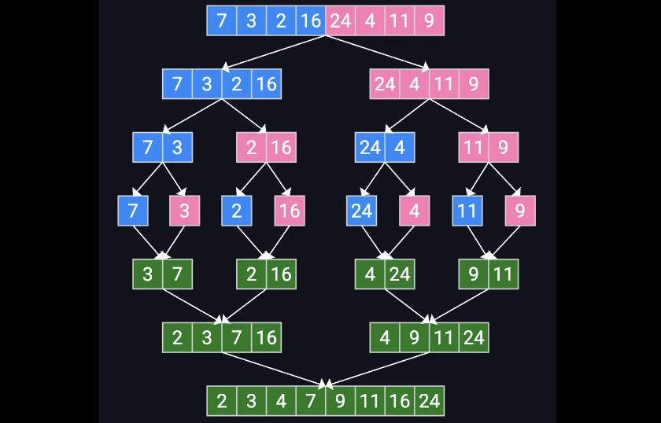

## 📚Recursion

### 递归的核心结构

```java
//阶乘factoral
public static int fact(int n) {
    if (n <= 1) return 1;        // base case
    return n * fact(n - 1);      // recursive case
}
```

- **Base case（终止条件）**：不再递归时直接返回的情况（否则会无限递归/栈溢出）
- **Recursive case（递归推进）**：把问题规模变小，并调用自己
- **返回值的“回溯阶段”**：递归一路下去以后，返回时如何把结果组合起来

### 📌 Case:

```java
//Fibonacci
public static int fib(int n) {
    if (n == 0) return 0;   // base case
    if (n == 1) return 1;   // base case
    return fib(n - 1) + fib(n - 2); // recursive case
}
```

```java
public static int fib(int n) {
    return fibHelper(n, 0, 1); // a=fib(0), b=fib(1)
}

private static int fibHelper(int n, int a, int b) {
    if (n == 0) return a;
    return fibHelper(n - 1, b, a + b);
}
```

```java
//幂（a^b）
public static int power(int a, int b) {
    if (b == 0) return 1;
    return a * power(a, b - 1);
}
```

```java
//字符串反转
public static String reverse(String s) {
    if (s.length() <= 1) return s;
    return reverse(s.substring(1)) + s.charAt(0);
}
```

```java
//isPalindrome
public static boolean isPalindrome(String s) {
    if (s.length() <= 1) return true;
    if (s.charAt(0) != s.charAt(s.length() - 1)) return false;
    return isPalindrome(s.substring(1, s.length() - 1));
}
```

```java
//统计字符出现次数 countChar
public static int countChar(String s, char target) {
    if (s.length() == 0) return 0;
    int add = (s.charAt(0) == target) ? 1 : 0;
    return add + countChar(s.substring(1), target);
}
```

```java
//求和 sum
public static int sum(int[] a) {
    return sumFrom(a, 0);
}

private static int sumFrom(int[] a, int i) {
    if (i == a.length) return 0;
    return a[i] + sumFrom(a, i + 1);
}
```

```java
//数组最大值 max（同样用 helper）
public static int max(int[] a) {
    return maxFrom(a, 0);
}

public static int maxFrom(int[] a, int i) {
    if (i == a.length - 1) return a[i];
    return Math.max(a[i], maxFrom(a, i + 1));
}

```

```java
//BinarySearch
public static int binSearch(int[] a, int target) {
    return binSearch(a, target, 0, a.length - 1);
}

private static int binSearch(int[] a, int target, int lo, int hi) {
    if (lo > hi) return -1;
    int mid = (lo + hi) / 2;
    if (a[mid] == target) return mid;
    if (target < a[mid]) return binSearch(a, target, lo, mid - 1);
    return binSearch(a, target, mid + 1, hi);
}
```

```java
//递归输出
public static void mystery(int n) {
    if (n == 0) return;
    System.out.print(n + " ");   // 打印在递归前
    mystery(n - 1);
    //System.out.print(n + " ");   // 打印在递归后
}
```

归并排序



```java
import java.util.Arrays;
public class MergeSortVersion {
    // Merges the left/right elements into a sorted result.
    // Precondition: left/right are sorted
    public static void merge(int[] result, int[] left, int[] right) {
        int i1 = 0; // index into left array
        int i2 = 0; // index into right array
        for (int i = 0; i < result.length; i++) {
            if ((i1 < left.length && left[i1] <= right[i2])||i2 >= right.length) {
                result[i] = left[i1]; // take from left
                i1++;
            } else {
                result[i] = right[i2]; // take from right
                i2++;
            }
        }
    }
    // Rearranges the elements of a into sorted order using the merge sort algorithm (recursive).
    public static void mergeSort(int[] a) {
        if (a.length >= 2) {
            // split array into two halves
            int[] left  = Arrays.copyOfRange(a, 0, a.length / 2);
            int[] right = Arrays.copyOfRange(a, a.length / 2, a.length);
            // sort the two halves
            mergeSort(left);
            mergeSort(right);
            // merge the sorted halves into a sorted whole
            merge(a, left, right);
        }
    }

    // quick test
    public static void main(String[] args) {
        int[] a = {5, 2, 9, 1, 5, 6};
        mergeSort(a);
        System.out.println(Arrays.toString(a));
    }
}

```

***

### 🎯 A. 追踪输出题（Tracing / Call Stack）

### 1)

```java
public static void mystery1(int n) {
    if (n <= 0) {
        System.out.print("X");
    } else {
        System.out.print(n + " ");
        mystery1(n - 2);
        System.out.print(n + " ");
    }
}
```

问：调用 `mystery1(5)` 的输出是什么？

### 2)

```java
public static void mystery2(String s) {
    if (s.length() <= 1) {
        System.out.print(s);
    } else {
        mystery2(s.substring(1));
        System.out.print(s.charAt(0));
    }
}
```

问：调用 `mystery2("APCSA")` 输出什么？

### 3)

```java
public static int mystery3(int a, int b) {
    if (b == 0) return a;
    return mystery3(b, a % b);
}
```

问：`mystery3(48, 18)` 返回多少？（并说明它在做什么）

### B. 补全代码题（Fill in the blanks）

### 4) 递归统计字符出现次数

完成 `countChar`，统计字符串 `s` 中 `target` 出现的次数。

```java
public static int countChar(String s, char target) {
    // base case: _______
    if (_________________) {
        return _______;
    }
    int add = (s.charAt(0) == target) ? 1 : 0;
    // recursive step: _______
    return add + ____________________________;
}
```

### 5) 递归判断数组是否单调非递减（helper 版本）

实现 `isSorted`：若数组从左到右不下降（允许相等）返回 true。

```java
public static boolean isSorted(int[] a) {
    return isSortedFrom(a, 0);
}

private static boolean isSortedFrom(int[] a, int i) {
    // base case: 当 i 到达 _______ 时返回 true
    if (_________________________) return true;

    // 若当前一对不满足，返回 false
    if (a[i] > a[i + 1]) return false;

    // recursive call
    return _______________________;
}
```

### C. 写递归方法题（Free Response 风格）

### 6) 写一个递归方法：sumDigits

返回正整数 `n` 的各位数字之和。
 例：`sumDigits(5029) -> 16`

要求：必须递归（不要用循环）。

```java
public static int sumDigits(int n) {
    // your code
}
```

### 7) 写一个递归方法：count7

统计整数 `n` 的十进制表示中数字 `7` 出现次数。
 例：`count7(77027) -> 3`

```java
public static int count7(int n) {
    // your code
}
```

### 8) 写一个递归方法：isPalindrome

忽略大小写，只判断是否回文（不要求去空格/标点）。
 例：`isPalindrome("Racecar") -> true`

```java
public static boolean isPalindrome(String s) {
    // your code
}
```

