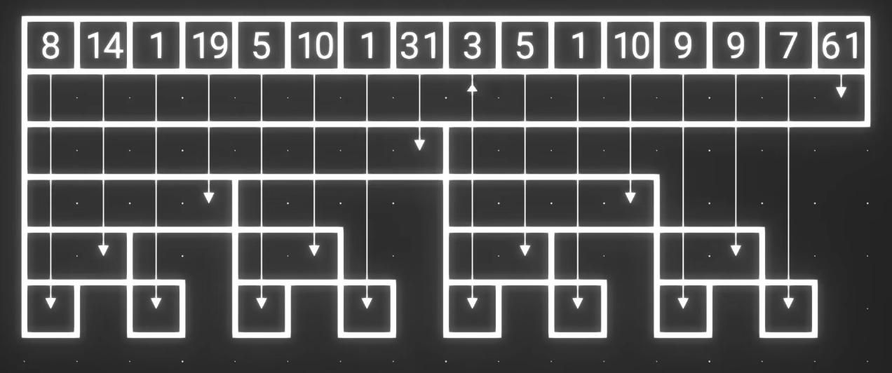

## 📚BIT（Binary Indexed Tree）

### 🧠 1) BIT的基本构造



- 序号为i的序列正好是长度为 **lowBit(i)** 且以 **i** 为结尾的序列。
- 一个序列b[i]正上方的序列正好是**b[i+lowBit(i)]**

### 1. 单点修改+前缀/区间查询

```c++
//把某个位置的值增加 v
//快速计算前缀和、区间和
//i & -i会保留 i 二进制中最右边的那个 1，其他位全部清零。
//bit[i] 存储的是一段区间的和
struct BIT {
    int n;
    vector<long long> bit;

    BIT(int n) : n(n), bit(n + 1) {}

    void add(int i, long long v) {//单点增加函数
        for (; i <= n; i += i & -i) //lowbit(i)=i & -i
            bit[i] += v;
    }

    long long sum(int i) {//求前缀和
        long long res = 0;
        for (; i > 0; i -= i & -i)//去掉当前已经统计过的区间，然后继续统计左侧剩余区间
            res += bit[i];
        return res;
    }

    long long query(int l, int r) {//求区间和
        return sum(r) - sum(l - 1);
    }
};
```

### 2. 坐标压缩 + BIT

> 给定数组，统计逆序对数量。
> 逆序对是满足 i<j 且 a[i]>a[j] 的元素对

```c++
//a = [100, 20, 50, 20]
//原数组：    [100, 20, 50, 20]
//压缩之后：  [  3,  1,  2,  1]
#include <bits/stdc++.h>
using namespace std;

struct BIT {
    int n;
    vector<int> tree;
    BIT(int size) {
        n = size;
        tree.assign(n + 1, 0);
    }

    // 在位置 i 增加 value
    void add(int i, int value) {
        while (i <= n) {
            tree[i] += value;
            i += i & -i;
        }
    }

    // 查询 [1, i] 的出现次数
    int sum(int i) {
        int result = 0;
        while (i > 0) {
            result += tree[i];
            i -= i & -i;
        }
        return result;
    }
};

int main() {
    vector<long long> a = {100, 20, 50, 20};

    // 坐标压缩
    vector<long long> values = a;

    sort(values.begin(), values.end());

    values.erase(
        unique(values.begin(), values.end()),
        values.end()
    );

    int m = values.size();
    BIT bit(m);

    long long answer = 0;

    for (int i = 0; i < a.size(); i++) {
        // 找到 a[i] 的压缩排名
        int rank =
            lower_bound(values.begin(), values.end(), a[i])
            - values.begin() + 1;

        // i 是已经处理过的元素数量
        // bit.sum(rank) 是其中小于等于 a[i] 的数量
        // 两者相减就是严格大于 a[i] 的数量
        answer += i - bit.sum(rank);

        // 当前排名出现次数增加 1
        bit.add(rank, 1);
    }

    cout << answer << '\n';
}
```

### 3. 离线排序 / 扫描线 + BIT

> 平面上有若干个点：(1,3), (2,1), (4,2), (5,4)
>
> 每个查询给出 `(X,Y)`，要求统计
>
> 有多少个点同时满足 `x <= X` 且 `y <= Y`？

例如：(1,3), (2,1), (4,2), (5,4) 。查询1：(2,3)；查询2：(4,1)；查询3：(5,3)。

思路：`x` 通过排序和扫描线处理；`y` 通过 BIT 处理。

1. 按照 `x` 从小到大扫描点；
2. 当处理查询 `(X,Y)` 时，把所有满足 `x <= X` 的点加入 BIT；
3. BIT 按照 `y` 维护已经加入点的数量；
4. 查询 `y <= Y` 的点有多少个。

这就是二维问题降成一维问题的典型方法。

```c++
//离线查询是把查询重新排序了
#include <bits/stdc++.h>
using namespace std;

struct BIT {
    int n;
    vector<int> tree;

    BIT(int n) {
        this->n = n;
        tree.assign(n + 1, 0);
    }

    // 在位置 i 增加 value
    void add(int i, int value) {
        while (i <= n) {
            tree[i] += value;
            i += i & -i;
        }
    }

    // 查询 [1, i] 的总和
    int sum(int i) {
        int result = 0;

        while (i > 0) {
            result += tree[i];
            i -= i & -i;
        }

        return result;
    }
};

struct Point {
    int x;
    int y;
};

struct Query {
    int x;
    int y;
    int id;
};

int main() {
    vector<Point> points = {
        {1, 3},
        {2, 1},
        {4, 2},
        {5, 4}
    };

    vector<Query> queries = {
        {2, 3, 0},
        {4, 1, 1},
        {5, 3, 2}
    };

    // 收集所有点的 y，用于坐标压缩
    vector<int> ys;

    for (Point p : points) {
        ys.push_back(p.y);
    }

    sort(ys.begin(), ys.end());

    ys.erase(
        unique(ys.begin(), ys.end()),
        ys.end()
    );

    // 点按照 x 排序
    sort(points.begin(), points.end(),
         [](Point a, Point b) {
             return a.x < b.x;
         });

    // 查询按照 x 排序
    sort(queries.begin(), queries.end(),
         [](Query a, Query b) {
             return a.x < b.x;
         });

    BIT bit(ys.size());

    vector<int> answer(queries.size());

    int pointIndex = 0;

    for (Query query : queries) {

        // 把所有 x <= query.x 的点加入 BIT
        while (pointIndex < points.size() &&
               points[pointIndex].x <= query.x) {

            int y = points[pointIndex].y;

            // 点的 y 转换为压缩排名
            int rank =
                lower_bound(ys.begin(), ys.end(), y)
                - ys.begin() + 1;

            bit.add(rank, 1);

            pointIndex++;
        }

        /*
         upper_bound 返回第一个大于 query.y 的位置。

         因此 pos 表示：
         有多少个压缩后的 y 值 <= query.y
        */
        int pos =
            upper_bound(ys.begin(), ys.end(), query.y)
            - ys.begin();

        answer[query.id] = bit.sum(pos);
    }

    // 按照查询原来的顺序输出
    for (int x : answer) {
        cout << x << '\n';
    }
}
```

### 📌 2）例题

- 2026 First Contest Gold P2-Milk Buckets

  > 1. 让最终剩下的那个桶中的牛奶量尽可能大。
  >
  > 2. 最少需要进行多少次相邻交换。

  题意：你可以先通过相邻交换重新排列数组，然后任意选择相邻合并顺序；求为了让最终平均合并结果最大，最少需要交换多少次。

 每次合并：
$$
x,y\rightarrow \frac{x+y}{2}
$$
一个原始桶如果经历了 d 次合并，那么它在最终答案中的贡献是：
$$
a_i\cdot 2^{-d}
$$
所以：

- 越晚合并，权重越大；
- 较大的数应该尽量晚合并；
- 较小的数应该尽量早合并。

因此，最大化最终结果时，可以不断合并当前最小的两个值。

- 数组必须以v型排列最优：大 → 小 → 最小 → 小 → 大
- 用最少相邻交换，把原数组变成任意一个 V 形排列

每个元素的最小贡献是：
$$
\min(L_i,R_i)
$$
L_i: 原数组中aI左边严格小于它的元素数量

R_i:原数组中ai右边严格小于它的元素数量

最终答案：
$$
\boxed{\sum_{i=1}^{N}\min(L_i,R_i)}
$$
例如 [9,4,9,2]：

```c++
#include <bits/stdc++.h>
using namespace std;

struct BIT {
    int n;
    vector<int> tree;
    //BIT 的下标是原数组的位置，BIT 的值表示这个位置上是否已经放入了一个更小元素。
    BIT(int n) {
        this->n = n;
        tree.assign(n + 1, 0);
    }

    // 在位置 i 增加 value
    void add(int i, int value) {
        while (i <= n) {
            tree[i] += value;
            i += i & -i;
        }
    }

    // 查询 [1, i] 的和
    int sum(int i) {
        int result = 0;

        while (i > 0) {
            result += tree[i];
            i -= i & -i;
        }

        return result;
    }
};

int main() {
    ios::sync_with_stdio(false);
    cin.tie(nullptr);

    int T;
    cin >> T;

    while (T--) {
        int N;
        cin >> N;

        vector<int> a(N);

        for (int i = 0; i < N; i++) {
            cin >> a[i];
        }

        // 保存原数组下标
        vector<int> order(N);

        for (int i = 0; i < N; i++) {
            order[i] = i;
        }

        // 按照数值从小到大排序下标
        sort(order.begin(), order.end(),
             [&](int x, int y) {
                 return a[x] < a[y];
             });

        BIT bit(N);
        long long answer = 0;

        int l = 0;

        while (l < N) {
            int r = l;

            // 找出数值相同的一整组
            while (r < N &&
                   a[order[r]] == a[order[l]]) {
                r++;
            }

            /*
             先查询这一组。

             此时 BIT 中只有严格小于当前值的元素。
            */
            for (int k = l; k < r; k++) {
                int pos = order[k] + 1;  // 转为 1-based

                // 原数组位置严格在当前元素左边
                int left = bit.sum(pos - 1);

                int totalSmaller = bit.sum(N);

                // 其余严格更小元素都在右边
                int right = totalSmaller - left;

                answer += min(left, right);
            }

            // 查询完后，再把整组相等元素加入 BIT
            for (int k = l; k < r; k++) {
                int pos = order[k] + 1;
                bit.add(pos, 1);
            }

            l = r;
        }

        cout << answer << '\n';
    }
}
```

- 2025 US Open Gold P2 - Election Queries
- 2024 US Open Gold P2-Grass Segments
- 2024 Jan Gold - Photo Op

