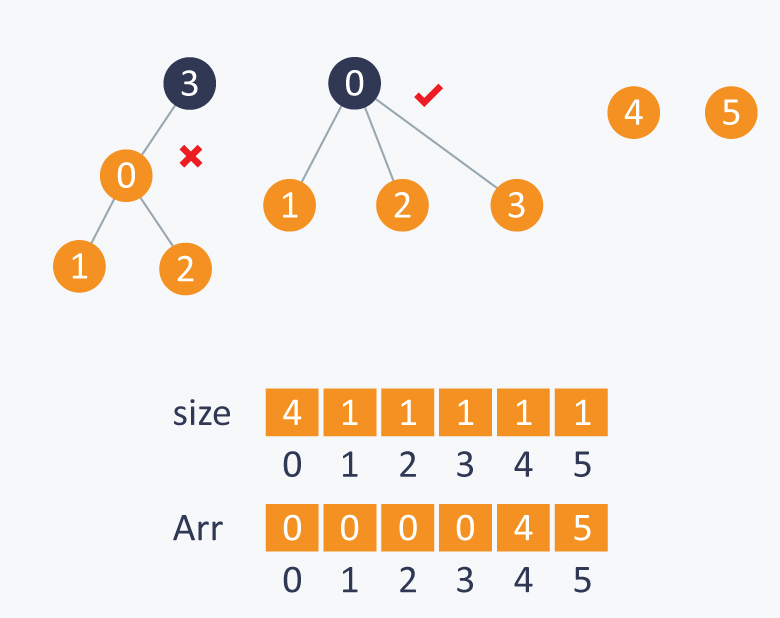

## 🌲 什么是图论（Graph Theory）？

**图论 = 研究“点 + 边”之间关系的数学和算法学科。**

一个图包含：

- **点（nodes / vertices）**
- **边（edges）**：连接点与点

就像你在地图、社交网络、电路图上看到的一样。

例如：

```
A -- B -- C
|         |
D ------- E
```

这是一个图，5 个节点、5 条边。

## 🧠 图论能解决什么问题？

图论用来解决各种“连接关系”的问题，例如：

- 两点之间能否到达？
- 到达需要几步？最短路径？
- 有哪些连通区域？
- 网络是否有环？
- 哪些节点之间必须在同一个集合？
- 树形结构如何遍历？

## 📊 图论中的常见图类型

### **① 无向图（undirected graph）**

A-B 和 B-A 是一样的（双向）。

### **② 有向图（directed graph）**

A → B 和 B → A 不一样。

### **③ 加权图（weighted graph）**

每条边有权重，例如距离、时间。

### **④ 树（tree）**

- 没有环
- N 个点有 N-1 条边
- 任意两点只有唯一一条路径

树是图的一种特殊情况。

## 🎯 图常用的建图方式

USACO 中最常用的是 **邻接表（adj list）**：

```c++
vector<vector<int>> g(n);
g[u].push_back(v);
g[v].push_back(u);   // 如果是无向图
```

另一种领接矩阵，**用一个 N×N 的矩阵表示点与点之间是否有边。**

如果图中有 N 个点（编号 0~N-1），那么邻接矩阵 `adj` 是一个二维数组：

```C++
adj[i][j] = 1  表示 i 与 j 有边  
adj[i][j] = 0  表示 i 与 j 没有边
```

如果是有权图，可以写成：

```c++
adj[i][j] = 边的权重
adj[i][j] = 0 或 INF → 没有边
```

## 🧩 图论的核心算法

🟢 **1. BFS（广度优先搜索）**

🟢 **2. DFS（深度优先搜索）**

🟢 **3. Flood Fill（染色）**

- 计算岛屿数量
- 标记一片区域
- 统计连通块面积

🟢 **4. Union-Find（并查集）**

- 判断两点是否在同一集合
- 合并集合
- 统计连通数量

🟡 **5. 简单树论**

### 📌 **Flood Fill 的核心逻辑**

Flood Fill = 通过 DFS/BFS 从起点把整块连通区域全部访问。

假设地图如下所示，想找所有 “#” 的连通块数量。

```c++
....#.
...##.
.#....
.###..
```

从每个未访问的 "#" 开始：

1. DFS/BFS 遍历整块区域
2. 把所有属于这块的点标记为 visited
3. 计数 +1（代表发现新的区域）

```c++
int n, m;
vector<string> grid;
bool vis[1005][1005];

int dx[4] = {1, -1, 0, 0};
int dy[4] = {0, 0, 1, -1};

void dfs(int x, int y) {
    vis[x][y] = true;

    for (int k = 0; k < 4; k++) {
        int nx = x + dx[k];
        int ny = y + dy[k];

        if (nx < 0 || nx >= n || ny < 0 || ny >= m) continue;
        if (vis[nx][ny]) continue;
        if (grid[nx][ny] != '#') continue;

        dfs(nx, ny);
    }
}
//
int cnt = 0;
for (int i = 0; i < n; i++) {
    for (int j = 0; j < m; j++) {
        if (grid[i][j] == '#' && !vis[i][j]) {
            dfs(i, j);  // 标记整块区域
            cnt++;      // 找到一块新的
        }
    }
}
```

### 📌 Union-Find / Disjoint Set Union，DSU（并查集）

##### **并查集是一种用来管理“多个不相交集合”的数据结构。**

它支持两个核心操作：

1. **Find（查找）**
   找到某个元素所属集合的“代表”（也叫根 root）
2. **Union（合并）**
   把两个集合合并成一个集合

##### 简单理解：

> **并查集 = 动态管理“谁和谁在一组”的神器**

在图论里它最常用于：

- 判断两个点是否连通
- 动态加边
- 连通块数量统计
- Kruskal（最小生成树，Gold 中更常见）

##### 并查集的核心思想

每个集合像一棵小树，每棵树有一个根（root）`find(x)` 就是找到这棵树的根。

合并两个集合（union）就是： 让一个树的根指向另一个树的根。

为了更快，它会做两件优化：

1. **路径压缩（Path Compression）**
2. **按秩合并（Union by Rank / Size）**

这保证效率非常快，几乎是 O(1)。



### 🧩 并查集的三大操作

### ① initianize **初始化**

一开始，每个元素自己是一个集合。

```c++
for (int i = 0; i < n; i++)
    parent[i] = i;    // 每个点都是自己的父亲
    size[i] = 1;      // 每个集合大小为 1
```

### ② **Find（查根）**

```C++
int find(int x) {
    if (parent[x] != x)
        parent[x] = find(parent[x]);    // 路径压缩
    return parent[x];
}
```

### 路径压缩是什么？

让每一次 find 都顺便把节点直接连到根。这样树的深度越来越平，查找几乎变成 O(1)。

### ③ **Union（合并两个集合）**

把 A 所属的集合 和 B 所属的集合连接起来：

```c++
void unite(int a, int b) {
    a = find(a);
    b = find(b);
    if (a == b) return; // 已经在同一个集合

    if (size[a] < size[b]) swap(a, b); // 按大小合并，让更小的树连到更大的树
    parent[b] = a;
    size[a] += size[b];
}
```

### 如何判断两点是否连通？

只需 check 根是否一样：

```c++
if (find(a) == find(b)) {
    // 连通
}
```

### 🧱 模板代码（C++）

```c++
struct DSU {
    vector<int> parent, sz;
    DSU(int n) {
        parent.resize(n);
        sz.resize(n, 1);
        for (int i = 0; i < n; i++)
            parent[i] = i;
    }
    int find(int x) {
        if (parent[x] != x)
            parent[x] = find(parent[x]);
        return parent[x];
    }
    void unite(int a, int b) {
        a = find(a);
        b = find(b);
        if (a == b) return;
        if (sz[a] < sz[b]) swap(a, b);
        parent[b] = a;
        sz[a] += sz[b];
    }

    bool same(int a, int b) {
        return find(a) == find(b);
    }
};
```

### 🎯 USACO 并查集最常用的 **5 种题型**

1. ### 动态连通性（Dynamic Connectivity）— 判断是否连通

> 不断 union(a, b)，然后问你 x 和 y 是否属于同一个集合。

### 典型任务：

- 判断道路两点是否可达
- 判断两头牛是否在同一群
- 判断两个牧场是否连接
- 判断两条路径是否等价

### 为什么用 DSU？

- 因为 **find(x)==find(y)** 判断连通最快
- 比 DFS / BFS 更快（O(α(n)) ≈ O(1)）

### 示例：

```c++
union(1,2)
union(2,3)
query: 1 和 3 连通吗？ → YES
```

> USACO 2020 January Silver Problem 3-Wormhole Sort

```C++
//牛 i 现在在哪个位置” 和 “它最终要站的位置 i” 是否属于同一连通块
//找一个值 X，使得 只允许使用宽度 ≥ X 的虫洞时，仍然能把所有牛排好；并且这个 X 要尽可能大。
#include <bits/stdc++.h>
using namespace std;

struct DSU {
    vector<int> parent, sz;
    DSU(int n = 0) {
        init(n);
    }
    void init(int n) {
        parent.resize(n + 1);
        sz.assign(n + 1, 1);
        for (int i = 1; i <= n; i++) parent[i] = i;
    }
    int find(int x) {
        if (parent[x] != x) parent[x] = find(parent[x]);
        return parent[x];
    }
    void unite(int a, int b) {
        a = find(a); b = find(b);
        if (a == b) return;
        if (sz[a] < sz[b]) swap(a, b);
        parent[b] = a;
        sz[a] += sz[b];
    }
};

int main() {
    ios::sync_with_stdio(false);
    cin.tie(nullptr);

    int N, M;
    if (!(cin >> N >> M)) return 0;
    vector<int> p(N + 1);
    bool sorted = true;
    for (int i = 1; i <= N; i++) {
        cin >> p[i];
        if (p[i] != i) sorted = false;
    }

    vector<tuple<int,int,int>> edges; // (w, a, b)
    edges.reserve(M);
    int a, b, w;
    int maxW = 0;
    for (int i = 0; i < M; i++) {
        cin >> a >> b >> w;
        edges.push_back({w, a, b});
        maxW = max(maxW, w);
    }

    if (sorted) {
        cout << -1 << "\n";
        return 0;
    }

    DSU dsu(N);

    auto check = [&](int X) -> bool {
        dsu.init(N);
        for (auto &e : edges) {
            int ww, x, y;
            ww = get<0>(e);
            x  = get<1>(e);
            y  = get<2>(e);
            if (ww >= X) dsu.unite(x, y);
        }
        for (int i = 1; i <= N; i++) {
            if (dsu.find(i) != dsu.find(p[i]))
                return false;
        }
        return true;
    };

    int lo = 1, hi = maxW, ans = 0;
    while (lo <= hi) {
        int mid = lo + (hi - lo) / 2;
        if (check(mid)) {
            ans = mid;      // mid 可行，想要更大
            lo = mid + 1;
        } else {
            hi = mid - 1;   // mid 太大，缩小
        }
    }

    cout << ans << "\n";
    return 0;
}

//并查集
//二分查找
//tuple、vector用法
```

### **2. 连通块统计（Connected Components）**

统计一共有多少个集合，或者每个集合大小是多少。

### 场景：

- 统计有多少个独立的组
- 统计每组的大小（size 数组）
- 牧场里有几群牛
- 有几个连通子图

### 使用方法：

每次 union 合并, 最后统计根节点数量即可。

### 为什么 DSU 很强？

- 自动维护集合合并
- 直接统计根节点数量 → O(n)

> USACO 2016 US Open Silver Problem 3-Closing the Farm

### **3. 等价关系处理（Equivalence Classes）— 分组问题**

USACO 很喜欢这种题：

> A 和 B 要放在一组
> C 和 D 要放在一组
> 他们是否会冲突？

比如：

- “这两头牛必须在一起”
- “这些编号属于同一类型”
- “某些条件让两个人必须等价”

### 典型例子（抽象）：

```c++
1 ~ 3   (1 和 3 同组)
3 ~ 5
问：1 和 5 是否同组？（YES）
```

> USACO 2016 December Gold Problem 1-Moocast

### **4. Kruskal / 最小生成树的简化版本**

虽然完整的 MST 通常是 **Gold 级**，但 Silver 会出现：

### 场景：

- 给一堆边，按某种顺序排序
- 按顺序加入边
- 用 DSU 判断是否形成环
- 或统计某个结构

比如：

```
如果边 (u,v) 已经连通，则跳过（否则成环）
否则合并
```

完全就是 Kruskal 的核心思想。

### 为什么用 DSU？

因为你需要快速判断：

- **加入一条边后是否会产生环**？
  → find(u)==find(v) 就会产生环
- 如果不会，就合并集合

USACO Silver 很喜欢这种轻度 MST 判断题。

> USACO 2015 February Silver Problem 3-Superbull（ MST + DSU 的代表题）

### **5. 离线查询（Offline Queries）— 倒序处理问题**

### 场景：

- 边被“删除 / 塌陷 / 关闭”
- 问你随着时间倒退，什么时候变得连通
- 许多条件下的“先删后问”

处理方法：

> **正向难 → 倒序变成 union**

比如：

- 原问题：不断删除道路，询问是否连通
- 倒序处理：从全部断开开始，倒着加道路

这是 DSU 非常强的技巧，竞赛常用。

### 为什么是 DSU？

因为：

- 正向删除很难维护连通性
- 反向加入非常简单（union）

> USACO 2016 US Open Silver Problem 3-Closing the Farm

***

### 最短路

        1
       / \
      2   3
      |   |
      4   5
       \ /
        6

> 从 1 到其他节点的最短距离是多少？

边权全是 1 → BFS（所谓最短路，就是经过最少的边）

```c++
queue<int> q;
vector<int> dist(n + 1, -1);
dist[s] = 0;
q.push(s);
while (!q.empty()) {
    int u = q.front();
    q.pop();
    for (int v : adj[u]) {
        if (dist[v] == -1) {
            dist[v] = dist[u] + 1;
            q.push(v);
        }
    }
}
```

**边权只有 0/1 → 0-1** 

- 这里走BFS有问题，不一定距离+1，有时候加0，有时候加1。

这里会用到deque 双端队列

```c++
if (w == 0) //边权 = 0
    dq.push_front(v);//放到队首
else //边权 = 1
    dq.push_back(v);//放到队尾
```

```c++
deque<int> dq;
vector<int> dist(n + 1, INF);
dist[s] = 0;
dq.push_front(s);
while (!dq.empty()) {
    int u = dq.front();
    dq.pop_front();
    for (auto [v, w] : adj[u]) {
        if (dist[v] > dist[u] + w) {
            dist[v] = dist[u] + w;
            if (w == 0)
                dq.push_front(v);
            else
                dq.push_back(v);
        }
    }
}
```

**BFS 边权 >= 0 → Dijkstra**

例如：

```
        5
    A ------ B
    |        |
  10|        |2
    |        |
    C ------ D
        1
```

从 A 出发。

可能：

```c++
A → C = 10

A → B = 5

A → B → D
= 5 + 2
= 7

A → B → D → C
= 5 + 2 + 1
= 8
```

所以：

```c++
dist[B] = 5
dist[D] = 7
dist[C] = 8
```

> **从目前所有未处理节点中，选择距离起点最近的那个。dist[v]=min(dist[v],dist[u]+w)**


```c++
#include <bits/stdc++.h>
using namespace std;
using ll = long long;
const ll INF = 4e18;
int main() {
    int n, m;
    cin >> n >> m;
    vector<vector<pair<int, int>>> adj(n + 1);
    // 读入边
    for (int i = 0; i < m; i++) {
        int u, v, w;
        cin >> u >> v >> w;
        adj[u].push_back({v, w});
        adj[v].push_back({u, w}); // 无向图
        // 如果是有向图，只保留：
        // adj[u].push_back({v, w});
    }
    int s;
    cin >> s; // 起点
    vector<ll> dist(n + 1, INF);
    priority_queue<
        pair<ll, int>,
        vector<pair<ll, int>>,
        greater<pair<ll, int>>
    > pq; // 最小堆，找到当前 dist 最小的节点
    dist[s] = 0;
    pq.push({0, s}); // {距离, 节点}
    while (!pq.empty()) {
        auto [d, u] = pq.top();
        pq.pop();
        // 这是旧的、已经过时的状态
        if (d != dist[u])
            continue;
        // 遍历 u 的所有邻居
        for (auto [v, w] : adj[u]) {
            // 松弛操作 Relaxation
            if (dist[v] > dist[u] + w) {
                dist[v] = dist[u] + w;
                pq.push({dist[v], v});
            }
        }
    }
    // 输出从 s 到所有节点的最短距离
    for (int i = 1; i <= n; i++) {
        if (dist[i] == INF) {
            cout << "INF\n";
        } else {
            cout << dist[i] << '\n';
        }
    }
    return 0;
}
```

***

### 最小生成树MST

- ### Kruskal

> **用最便宜的边，把所有点连起来，同时避免形成环。**

思想：

1. 把所有边按照权值排序
2. 从小到大尝试加入
3. 如果加入后不会形成环，就加入
4. 直到选择 N-1 条边

```c++
struct Edge{
    int u,v,w;
};
vector<Edge> edges;
sort(edges.begin(), edges.end(),
[](Edge a, Edge b){
    return a.w < b.w;
});
int ans=0;
int cnt=0;
for(auto e:edges){
    int a=find(e.u);
    int b=find(e.v);
    if(a!=b){
        unite(a,b);
        ans += e.w;
        cnt++;
        if(cnt==n-1)
            break;
    }
}
```

- ### Prim

> Prim：从一个点开始，不断把“离当前生成树最近的点”加入进来。

```c++
#include <bits/stdc++.h>
using namespace std;
using pii = pair<int,int>;
int main(){
    int n, m;
    cin >> n >> m;
    vector<vector<pii>> adj(n+1);
    //建图
    for(int i=0;i<m;i++){
        int u,v,w;
        cin >> u >> v >> w;
        adj[u].push_back({v,w});
        adj[v].push_back({u,w});
    }
    vector<int> key(n+1, INT_MAX);
    vector<bool> used(n+1,false);  //是否已加入到集合
    priority_queue<
        pii,
        vector<pii>,
        greater<pii>
    > pq;
    // 从1号点开始
    key[1]=0;
    pq.push({0,1}); //加入第一个点的代价为0;
    int mst_cost=0;
    int count=0;
    while(!pq.empty()){
        auto [w,u]=pq.top();
        pq.pop();
        if(used[u])
            continue;
        used[u]=true;
        mst_cost += w;
        count++;
        for(auto [v,weight]:adj[u]){
            if(!used[v] && weight < key[v]){
                key[v]=weight;
                pq.push({key[v],v});
            }
        }
    }
    if(count != n){
        cout<<"Graph is not connected\n";
    }else{
        cout<<mst_cost<<"\n";
    }
}
/*
4 5
1 2 2
1 3 6
2 3 5
2 4 3
3 4 4*/
```

- ### Topological Sort

Topological Sort 是 **有向无环图（DAG, Directed Acyclic Graph）** 中非常重要的算法。

> 不断选择当前没有前置依赖（入度为 0）的节点加入答案，并删除它对其他节点的影响，直到所有节点都被处理。

```c++
#include <bits/stdc++.h>
using namespace std;
int main(){
    int n,m;
    cin>>n>>m;
    vector<vector<int>> adj(n+1);
    vector<int> indegree(n+1);
    for(int i=0;i<m;i++){
        int u,v;
        cin>>u>>v;
        // u必须先于v
        adj[u].push_back(v);
        indegree[v]++;
    }
    queue<int> q;
    // 找入度为0节点
    for(int i=1;i<=n;i++){
        if(indegree[i]==0)
            q.push(i);
    }
    vector<int> topo;
    while(!q.empty()){
        int u=q.front();
        q.pop();
        topo.push_back(u);
        for(int v:adj[u]){
            indegree[v]--;
            if(indegree[v]==0)
                q.push(v);
        }
    }
    // 有环
    if(topo.size()!=n){
        cout<<"Impossible\n";
    }else{
        for(int x:topo)
            cout<<x<<" ";
    }
}
```

***

### 树

- LCA（Lowest Common Ancestor）

### 1. 什么是 LCA？

假设有一棵有根树，对于两个节点 `u` 和 `v`：

> **LCA(u, v)** = 同时是 `u` 和 `v` 的祖先，并且距离 `u、v` 最近的那个祖先。

这里的“最近”，可以理解成：

> 在所有公共祖先里，深度最大的那个节点。

例如：

```
        1
       / \
      2   3
     / \   \
    4   5   6
       / \
      7   8
```

以 `1` 为根。

```
LCA(4, 7) = 2
```

### 2. 如果一个节点本身就是另一个节点的祖先呢？

```java
LCA(2, 7) = 2  //一个节点也算自己的祖先
```

### 3. 为什么 LCA 很重要？

LCA 最大的用途：求树上两个节点之间的距离。

假设：

```java
depth[u]
```

表示节点 `u` 到根节点的距离（边数）。

那么：

```java
dist(u, v)=depth[u] + depth[v] - 2 * depth[LCA(u,v)]
```

例如：

```java
        1
       /
      2
     / \
    4   5
       /
      7
```

求：

```java
dist(4, 7)
```

我们知道：

```java
depth[4] = 2
depth[7] = 3
LCA(4,7) = 2
depth[2] = 1
```

于是：

```java
dist(4,7)
= 2 + 3 - 2 × 1
= 3
```

实际路径：

```
4 → 2 → 5 → 7
```

确实有 `3` 条边。

因此可以记住一个非常重要的公式：

```java
dist(u, v)=depth[u] + depth[v] - 2 * depth[LCA(u,v)]
```

### 4. 最暴力的 LCA 怎么求？

最简单的方法就是先让两个节点处于相同深度，再让 `u` 不断找父亲：

```
u = parent[u]
```

直到：

```c++
depth[u] == depth[v]
```

然后两个人一起往上：

```c++
while (u != v) {
    u = parent[u];
    v = parent[v];
}
```

最后相遇的位置就是 LCA。

```c++
int lca(int u, int v) {
    while (depth[u] > depth[v])
        u = parent[u];
    while (depth[v] > depth[u])
        v = parent[v];
    while (u != v) {
        u = parent[u];
        v = parent[v];
    }
    return u;
}
```

如果树是一条链，每次查询可能都要往上走 `N` 次，如果有`Q`次查询，时间复杂度是`O(NQ)`。

### 5. LCA通常使用Binary Lifting（二进制倍增）

```java
up[u][j]  //u 向上跳 2^j 层之后的祖先。
  
up[u][j] = up[up[u][j-1]][j-1]; //2^j = 2^(j-1) + 2^(j-1)
//可以先跳 2^(j-1)，再跳 2^(j-1)
  
//例如原本要往上跳 1000 层，现在只要跳6层。
//1000= 2^9 + 2^8 + 2^7 + 2^6 + 2^5 + 2^3= 512 + 256 + 128 + 64 + 32 + 8
//现在时间复杂度是O(log N)
for (int j = LOG - 1; j >= 0; j--) {
    if ((diff >> j) & 1) {
        u = up[u][j];  //逐级跳
}
```

例如求：

```
u 的 8 层祖先
```

可以：

```java
先找到 u 的 4 层祖先 x
再找到 x 的 4 层祖先
```

```java
const int MAXN = 200005;
const int LOG = 20;

vector<int> adj[MAXN];

int depth[MAXN];
int up[MAXN][LOG];

//从根节点开始遍历整棵树，同时计算每个节点的深度 depth，以及它的 1、2、4... 层祖先 up[u][j]
void dfs(int u, int parent) {
    up[u][0] = parent;
//预处理2层祖先、4层祖先、8层祖先、16层祖先……
    for (int j = 1; j < LOG; j++) {
        up[u][j] = up[up[u][j - 1]][j - 1];
    }
    for (int v : adj[u]) {
        if (v == parent)
            continue; //如果这个邻居就是我父亲，就不要再回去了。
        depth[v] = depth[u] + 1;
        dfs(v, u);
    }
}
```

### 6. Binary Lifting 求 LCA 的核心过程

第一步：让两个节点深度相同，如果 depth[u] > depth[v]，让 `u` 按 2^j 方式往上跳。

第二步：一起往上跳，直到跳到LCA 的两个直接孩子位置，最后返回其父节点位置即是LCA位置。

> 两个人跳完之后相同”只能说明你已经到达了某个公共祖先，但不保证它是最近的公共祖先。

深度一样以后，我们从最大的 `j` 开始检查：

```java
if (up[u][j] != up[v][j]) {
    u = up[u][j];
    v = up[v][j];
}
```

意思是：

> 如果两个人向上跳 `2^j` 层之后还不是同一个节点，那么可以放心一起跳上去。

直到：

```java
u 和 v 已经站在 LCA 的两个直接孩子位置
```

这时候：

```java
return up[u][0];
```

就是 LCA。

```java
int lca(int u, int v) {
    // 保证 u 更深
    if (depth[u] < depth[v])
        swap(u, v);
    // 先让 u 和 v 到相同深度
    int diff = depth[u] - depth[v];
    for (int j = LOG - 1; j >= 0; j--) {
        if ((diff >> j) & 1) {
            u = up[u][j];
        }
    }
    // 如果此时已经相等
    if (u == v)
        return u;
    // 一起往上跳
    for (int j = LOG - 1; j >= 0; j--) {
        if (up[u][j] != up[v][j]) {
            u = up[u][j];
            v = up[v][j];
        }
    }
    return up[u][0]; //不是直接跳到 LCA,而是尽可能靠近,最终up[u][0]是共同的父节点。
}
```

### 7. Case

```java
                 1
              /     \
             2       3
           /   \    / \
          4     5  6   7
         /     / \
        8     9  10
       /
      11
```

求 LCA (11,10)，很显然等于LCA=2，观察Binary Lifting 是怎么找到这个 `2` 的。

### 第一步：记录 depth

假设根节点 `1` 的深度是 `0`：

```
节点      depth

1           0
2,3         1
4,5,6,7     2
8,9,10      3
11          4
```

所以：

```
depth[11] = 4
depth[10] = 3
```

两个节点深度不一样。

### 第二步：先让它们到同一深度

当前：

```
11   depth = 4
10   depth = 3
```

差：

```
diff = 4 - 3 = 1
```

所以把 `11` 向上跳 `1` 层：

```
11
 ↑
 8
```

于是：

```
u = 8
v = 10
```

现在：

```
depth[8] = 3
depth[10] = 3
```

终于在同一层了。

树上现在相当于：

```
                 1
              /     \
             2       3
           /   \
          4     5
         /     / \
        8     9  10
        ↑        ↑
        u        v
```

现在真正开始找 LCA。

### 第三步：为什么不能直接一直往上？

如果普通方法，可以：

```
8 → 4 → 2
10 → 5 → 2
```

两个人一层一层走：

第一次：

```
8 → 4
10 → 5
```

还不一样。

第二次：

```
4 → 2
5 → 2
```

相遇：

```
2
```

所以 LCA 是 `2`。

Binary Lifting 的目标就是：

> 不要一层一层走，而是尝试一次跳 1、2、4、8……层。

### 第四步：先看看祖先表

对于节点 `8`：

```
8 的 1 层祖先 = 4
8 的 2 层祖先 = 2
8 的 4 层祖先 = 不存在/根以上
```

所以：

```
up[8][0] = 4     // 2^0 = 1
up[8][1] = 2     // 2^1 = 2
```

对于节点 `10`：

```
10 的 1 层祖先 = 5
10 的 2 层祖先 = 2
```

所以：

```
up[10][0] = 5
up[10][1] = 2
```

整理一下：

| 节点 | 1层祖先 `2^0` | 2层祖先 `2^1` |
| ---- | ------------- | ------------- |
| 8    | 4             | 2             |
| 10   | 5             | 2             |

现在关键来了。

### 第五步：从大步开始尝试

当前：

```
u = 8
v = 10
```

我们先尝试：

```
跳 2 层
```

看看：

```
up[8][1]  = 2
up[10][1] = 2
```

发现：

```
一样！
```

这意味着什么？

如果我们直接让两个人都跳 2 层：

```
8  → 2
10 → 2
```

那么直接就跳到了 LCA。

但 Binary Lifting 的第二阶段**故意不这么做**。

因为我们的目标是：

> 先找到 LCA 下面的两个孩子。

所以当：

```
up[u][j] == up[v][j]
```

时：

```
不要跳！
```

因为说明：

> 跳这么远会碰到一起，有可能直接越过我们想找的边界。

所以 `j = 1` 时不跳。

仍然：

```java
u = 8
v = 10
```

### 第六步：尝试小一点，跳 1 层

现在：

```
j = 0
```

也就是尝试跳：

```
2^0 = 1 层
```

看：

```
up[8][0] = 4
up[10][0] = 5
```

发现：

```
4 != 5
```

说明：

> 两个人跳一层以后依然不会相遇。

所以这个跳跃是安全的。

于是：

```
u = 4
v = 5
```

现在变成：

```java
       2
      / \
     4   5
     ↑   ↑
     u   v
```

### 第七步：循环结束

现在：

```
u = 4
v = 5
```

它们已经是 LCA 的两个孩子。

因为：

```
parent[4] = 2
parent[5] = 2
```

所以：

```
return up[u][0];
```

也就是：

```
up[4][0] = 2
```

最终：

```
LCA(11,10) = 2
```

```c++
#include <bits/stdc++.h>
using namespace std;

const int MAXN = 20;
const int LOG = 5;

vector<int> adj[MAXN];

int depth[MAXN];
int up[MAXN][LOG];

// DFS 预处理 depth 和 up 数组
void dfs(int u, int parent) {
    up[u][0] = parent;
    // 计算 2^j 层祖先
    for (int j = 1; j < LOG; j++) {
        up[u][j] = up[ up[u][j - 1] ][j - 1];
    }
    for (int v : adj[u]) {
        if (v == parent)
            continue;
        depth[v] = depth[u] + 1;
        dfs(v, u);
    }
}

int lca(int u, int v) {
    // -------------------------
    // 第一步：让 u 和 v 深度相同
    // -------------------------
    if (depth[u] < depth[v])
        swap(u, v);
    int diff = depth[u] - depth[v];
    for (int j = LOG - 1; j >= 0; j--) {
        if ((diff >> j) & 1) {
            u = up[u][j];
        }
    }
    // 如果调平之后已经相同
    if (u == v)
        return u;

    // -------------------------
    // 第二步：一起往上跳
    // -------------------------

    for (int j = LOG - 1; j >= 0; j--) {
        if (up[u][j] != up[v][j]) {
            u = up[u][j];
            v = up[v][j];
        }
    }
    // 此时 u 和 v 是 LCA 的两个孩子
    return up[u][0];
}

void addEdge(int u, int v) {
    adj[u].push_back(v);
    adj[v].push_back(u);
}

int main() {
    // 建树
    addEdge(1, 2);
    addEdge(1, 3);
    addEdge(2, 4);
    addEdge(2, 5);
    addEdge(3, 6);
    addEdge(3, 7);
    addEdge(4, 8);
    addEdge(5, 9);
    addEdge(5, 10);
    addEdge(8, 11);
    // 以 1 为根
    depth[1] = 0;
    // 根节点的祖先设为自己
    dfs(1, 1);
    cout << "LCA(11, 10) = " << lca(11, 10) << '\n';
    return 0;
}
```

### 一句话理解 LCA

你可以直接记成：

> **LCA 就是两个节点向根走时，第一次汇合的节点。**

而 Binary Lifting 的核心思想是通过空间换时间：

> **把“一层一层找祖先”，优化成按 1、2、4、8、16……层跳祖先。**

***

- Offline Reverse Processing（离线倒序处理）

> 当“正序处理操作”很困难时，先把所有操作读下来，然后从最后一个操作开始倒着处理。

它不是某一种具体数据结构，而是一种 **algorithmic technique / 思维方式**。

两个关键词分别是：

- Offline（离线）：你可以提前知道全部操作，而不是每来一个操作就必须立刻回答。
- Reverse Processing（倒序处理）**：把时间顺序从 1 -> Q 改成 Q->1。

### 为什么倒序有用

最经典的情况是：

> **删除很难，但添加很容易。**

例如图中有：

```
1 -- 2 -- 3 -- 4
```

如果正序要求删除：

```
2 -- 3
```

原来的一个连通块：

```
{1,2,3,4}
```

突然裂成：

```
{1,2}

{3,4}
```

这很麻烦。

尤其是普通 DSU：

```
union(a, b);
```

非常擅长把两个集合：

```
A    B
```

合并成：

```
A+B
```

但是它不会把：

```
A+B
```

再拆成：

```
A    B
```

所以：

> **DSU 擅长 merge，不擅长 split。**

### 如果倒着处理呢？

假设正序操作：

```
Add edge
Add edge
Remove edge
Remove edge
```

倒过来：

```c++
Remove 的反操作 → Add
Remove 的反操作 → Add
Add 的反操作    → Remove
Add 的反操作    → Remove
```

如果题目结构允许我们忽略或者特殊处理后面的那些 remove，那么原本困难的：

```c++
delete edge
```

就可能变成非常简单的：

```c++
union(u, v);
```

这就是 Offline Reverse Processing 最常见的用途。

- USACO 2022 January Contest, Gold - Problem 2. Farm Updates
- USACO 2016 US Open Silver — Closing the Farm
- USACO 2024 December Silver — Conveyor Belt

***

- DAG DP
- Rerooting

### Others

- SCC 强连通分量 
- 桥 / 割点
- 二分图
- Hierholzer