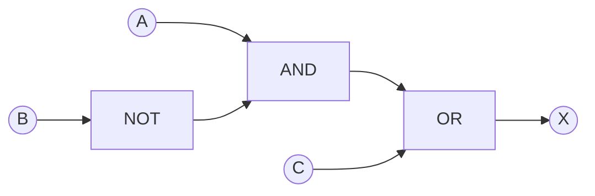
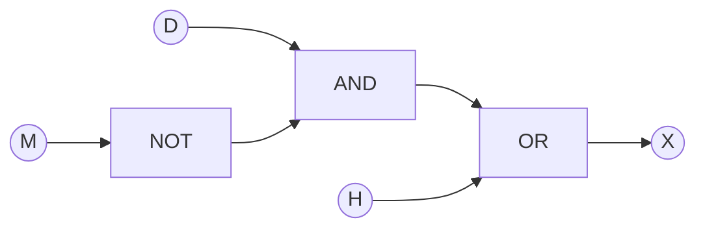

## 📚Chapter 10: Boolean Logic

### 📝 Lecture 01 · Six Logic Gates & Truth Tables

### 📌学习目标

1. 辨认六种标准逻辑门的符号、名称和用途。
2. 根据输入判断各逻辑门的输出。
3. 列出两输入、三输入真值表的全部行。

### 1. 逻辑门是什么？

**Logic gate（逻辑门）**接收代表 `0 / 1` 的输入，产生 `0 / 1` 的输出。**Truth table（真值表）**列出所有可能的输入组合及对应输出。单个 NOT 门只有一个输入；本章的其余五种门按两个输入学习。电路可以把多个门接起来，从而处理三个或更多外部输入。


**认图诀窍：** NOT 是三角形后加小圆圈；NAND = AND 后加小圆圈；NOR = OR 后加小圆圈；XOR 比 OR 在输入侧多一条弧线。小圆圈表示输出取反。

### 2. 六种门的功能

| **门** | 英文读法 | 输出为 1 的条件 | 逻辑表达式 |
|:---:|---|---|---|
| NOT | 非 | 输入为 0 | `X = NOT A` |
| AND | 与 | A、B **都**为 1 | `X = A AND B` |
| OR | 或 | A、B **至少一个**为 1，包括两个都为 1 | `X = A OR B` |
| NAND | 与非 | A、B **不同时**为 1 | `X = NOT (A AND B)` |
| NOR | 或非 | A、B **都**为 0 | `X = NOT (A OR B)` |
| XOR | 异或 | A、B **恰好一个**为 1 | `X = A XOR B` |

### NOT 的真值表

| A | NOT A |
|:---:|:---:|
| 0 | 1 |
| 1 | 0 |

### 其余五种门的真值表

| A | B | AND | OR | NAND | NOR | XOR |
|:---:|:---:|:---:|:---:|:---:|:---:|:---:|
| 0 | 0 | 0 | 0 | 1 | 1 | 0 |
| 0 | 1 | 0 | 1 | 1 | 0 | 1 |
| 1 | 0 | 0 | 1 | 1 | 0 | 1 |
| 1 | 1 | 1 | 1 | 0 | 0 | 0 |

> **易混：** OR 的 `1 OR 1 = 1`，XOR 的 `1 XOR 1 = 0`。NAND 是先做 AND，再把**结果**反转；并非分别把两个输入反转。

### 3. 真值表有多少行？

每个外部输入独立取 0 或 1，`n` 个输入共有 `2ⁿ` 种组合：两个输入 4 行、三个输入 8 行、四个输入 16 行。三输入表最可靠的排列方式如下。

| A | B | C |
|:---:|:---:|:---:|
| 0 | 0 | 0 |
| 0 | 0 | 1 |
| 0 | 1 | 0 |
| 0 | 1 | 1 |
| 1 | 0 | 0 |
| 1 | 0 | 1 |
| 1 | 1 | 0 |
| 1 | 1 | 1 |

**例题：** `X = A XOR B`，当 A=1、B=1 时，X=0；因为 XOR 要求恰好一个输入为 1。

### 课堂练习

1. 当 A=0、B=1 时，依次写出 AND、OR、NAND、NOR、XOR 的输出。
2. 当 A=1、B=1 时，哪个门输出 0：OR、XOR、NAND、NOR？可多选。
3. 逻辑门后面的小圆圈代表什么？写出 AND 与 NAND 的关系。（2 marks）
4. 若要只在两个开关都打开时点亮灯，选哪个门？若要只在两个开关状态不同时点亮灯呢？
5. 四个外部输入的真值表应有多少行？解释原因。（2 marks）

### Answer:


1. `0、1、1、0、1`。
2. XOR、NAND、NOR。OR 输出 1。
3. 小圆圈表示输出取反；NAND = NOT (A AND B)。
4. 分别为 AND、XOR。
5. `2⁴ = 16` 行；每个输入各有 2 种可能，组合数相乘。

### 📝 Lecture 02 · Circuits, Expressions & Truth Tables

### 学习目标

- 由逻辑表达式画出电路，并由电路反写表达式。
- 分层填写含三个输入的真值表。
- 根据真值表中输出为 1 的行写出正确表达式。

### 1. 表达式 → 电路

例题：`X = (A AND NOT B) OR C`。括号内先算：B 进 NOT，A 和 `NOT B` 进 AND；再让 AND 的输出与 C 进 OR。



上图的方框表示连接顺序；手绘答案中应改用标准门形状。**一个输入可以分叉**去多个门，分叉处画连接点；导线交叉而不连接时要明确区分。

### 2. 电路 → 表达式

从输入端往输出端，给每个中间结果命名，最后代入：

```text
P = NOT B
Q = A AND P
X = Q OR C
因此 X = (A AND NOT B) OR C
```

若最后一级是 NAND，例如 `X = P NAND Q`，则是 `NOT (P AND Q)`；括号不可省略成 `NOT P AND Q`。

### 3. 表达式 → 真值表

用相同例题，A、B、C 三个外部输入共 8 行。先算 `P=NOT B`，再算 `Q=A AND P`，最后算 `X=Q OR C`。

| A | B | C | P = NOT B | Q = A AND P | X = Q OR C |
|:---:|:---:|:---:|:---:|:---:|:---:|
| 0 | 0 | 0 | 1 | 0 | 0 |
| 0 | 0 | 1 | 1 | 0 | 1 |
| 0 | 1 | 0 | 0 | 0 | 0 |
| 0 | 1 | 1 | 0 | 0 | 1 |
| 1 | 0 | 0 | 1 | 1 | 1 |
| 1 | 0 | 1 | 1 | 1 | 1 |
| 1 | 1 | 0 | 0 | 0 | 0 |
| 1 | 1 | 1 | 0 | 0 | 1 |

**检查：** 当 C=1 时，最后一个 OR 必为 1。若该表中某个 C=1 的 X 填 0，就要回查。

### 4. 真值表 → 表达式

观察下面这张表，只挑出 `X=1` 的行。

| A | B | X |
|:---:|:---:|:---:|
| 0 | 0 | 0 |
| 0 | 1 | 1 |
| 1 | 0 | 1 |
| 1 | 1 | 0 |

行 `01` 对应 `NOT A AND B`，行 `10` 对应 `A AND NOT B`。用 OR 连接：

`X = (NOT A AND B) OR (A AND NOT B)`，也就是 `A XOR B`。这是按输出为 1 的行写出的表达式；**化简可选，先保证正确**。

### 三输入的完整示范

假设 X 只在 `A B C = 001、101、110` 时为 1，则

```text
001 → NOT A AND NOT B AND C
101 → A AND NOT B AND C
110 → A AND B AND NOT C
```

三项用 OR 连接，就是一个一定正确的表达式。可先画三个 AND 分支，再用 OR 门接起来；如果题目允许，之后再化简。

若所有行的 X 都是 0，可写 `X = 0`；若所有行都是 1，可写 `X = 1`。不同表达式可能产生完全相同的真值表，逐行比较即可验证。

### 课堂练习

1. 对 `Y = (A OR B) AND NOT C`，写出三个中间步骤，并给出 `A=0, B=1, C=0` 的输出。
2. 为 `Y = (A OR B) AND NOT C` 写出完整 8 行真值表。（4 marks）
3. 某输出 Z 只在 `AB=00` 和 `AB=11` 时为 1：按输出为 1 的行写出表达式；指出一种更短的写法。
4. `R = (A NAND B) XOR C`：当 `A=1, B=1, C=1` 时，先算 NAND，再算 XOR，结果是多少？

### Answer:


1. `P=A OR B`，`Q=NOT C`，`Y=P AND Q`；代入得 `P=1, Q=1, Y=1`。
2. 按 `ABC=000,001,010,011,100,101,110,111` 的顺序，Y 为 `0,0,1,0,1,0,1,0`。
3. `Z=(NOT A AND NOT B) OR (A AND B)`；也可以写为 `NOT (A XOR B)`。两个形式都正确。
4. `A NAND B = 0`；`0 XOR 1 = 1`，因此 R=1。

### Lecture 03 · Problem Statements & Chapter Review

### 学习目标

- 把真实场景中的 `ON/OFF`、警报条件翻译成逻辑表达式。
- 按表达式设计门电路并验证真值表。
- 检查输入编码、括号和输出条件是否一致。

### 1. 先定义每个 0 和 1

例题：小型设备有三个输入：

| 输入 | 0 代表 | 1 代表 |
|:---:|---|---|
| D | 门关闭 | 门打开 |
| M | 维护模式未开启 | 维护模式开启 |
| H | 温度正常 | 温度过高 |

警报 X=1 的条件是：**门打开且未开启维护模式；或者温度过高。**

拆成两段：门打开 `D`，未维护 `NOT M`，两者须同时满足；另一种触发是 `H`。因此：

`X = (D AND NOT M) OR H`

> **关键：** 文字中的“未开启”之所以写 `NOT M`，是因为本题规定 `M=1` 为“已开启”。别未经核对就把“高温”一律写 `NOT H`：取反与否取决于题目给出的 0/1 定义。

### 2. 表达式 → 门电路



依次需要 NOT、AND、OR 门各一个。若只允许**两个输入**的门，最后的 OR 正好接两条分支；三个条件用 OR 相连时需要逐层连接两个 OR 门。

### 3. 完整真值表

| D | M | H | NOT M | D AND NOT M | X |
|:---:|:---:|:---:|:---:|:---:|:---:|
| 0 | 0 | 0 | 1 | 0 | 0 |
| 0 | 0 | 1 | 1 | 0 | 1 |
| 0 | 1 | 0 | 0 | 0 | 0 |
| 0 | 1 | 1 | 0 | 0 | 1 |
| 1 | 0 | 0 | 1 | 1 | 1 |
| 1 | 0 | 1 | 1 | 1 | 1 |
| 1 | 1 | 0 | 0 | 0 | 0 |
| 1 | 1 | 1 | 0 | 0 | 1 |

逐行核查两个特征：**H=1 的四行 X 均为 1**；当 `H=0` 时，只有 `D=1,M=0` 才触发。

### 4. 考试中的四向转换

| 给出的信息 | 你要做的事 | 稳妥步骤 |
|---|---|---|
| 文字条件 | 表达式 / 电路 / 表 | 先抄清 0/1 定义，再把每个条件翻成 AND / OR / NOT |
| 逻辑表达式 | 电路 / 表 | 先处理括号并命名中间结果，再逐门连接、逐列计算 |
| 逻辑电路 | 表达式 / 表 | 从左至右标每个门的输出，最后代入并核对 |
| 真值表 | 表达式 / 电路 | 取输出为 1 的各行写 AND 项，再用 OR 连接 |

**常见错误：** 把 OR 误读成“只能选一个”；把 NAND 当成 `NOT A AND B`；忘记三输入真值表要 8 行；在实际场景中读反了参数的 0/1 定义。

### 综合练习

### 题 A：温室通风（8 marks）

输入 `T=1` 表示温度过高，`W=1` 表示风太大，`R=1` 表示正在下雨。只有**温度过高且风不大且没有下雨**，通风窗才打开（X=1）。

1. 写出 X 的逻辑表达式。（2 marks）
2. 按三个输入值从 `000` 到 `111`，写出 X 列。（4 marks）
3. 描述如何用逻辑门实现该表达式。（2 marks）

### 题 B：两条警报路径（6 marks）

输入 `P=1` 表示压力高，`V=1` 表示阀门打开，`S=1` 表示备用系统故障。警报 Y=1 当且仅当：**压力高且阀门关闭，或者备用系统故障且阀门打开。**

1. 写出 Y 的表达式。（2 marks）
2. 判断 `(P,V,S)=(1,0,0)`、`(0,1,1)`、`(1,1,0)`、`(1,0,1)` 时的输出。（4 marks）

### Answer:

**题 A：** `X=T AND NOT W AND NOT R`。按照 `TWR=000,001,010,011,100,101,110,111`，X 列为 `0,0,0,0,1,0,0,0`。两个 NOT 门分别处理 W、R，再用两级 2 输入 AND 门把 T、NOT W、NOT R 相连。表中唯一的 1 在 `100` 行。

**题 B：** `Y=(P AND NOT V) OR (S AND V)`。依次代入得 `1、1、0、1`。注意第二条路径的 `S AND V` 在 `(1,0,1)` 时为 0，但第一条路径仍为 1。

### 课后自测

1. 三输入的真值表多少行？答：8 行。
2. `1 OR 1` 与 `1 XOR 1` 分别是多少？答：1、0。
3. 门的输出端有小圆圈说明什么？答：该门结果被取反。
4. 真值表只有一行的输出为 1，应该怎样写表达式？答：把该行每个输入用 AND 连接，0 写成 NOT 输入，1 写成原输入。
